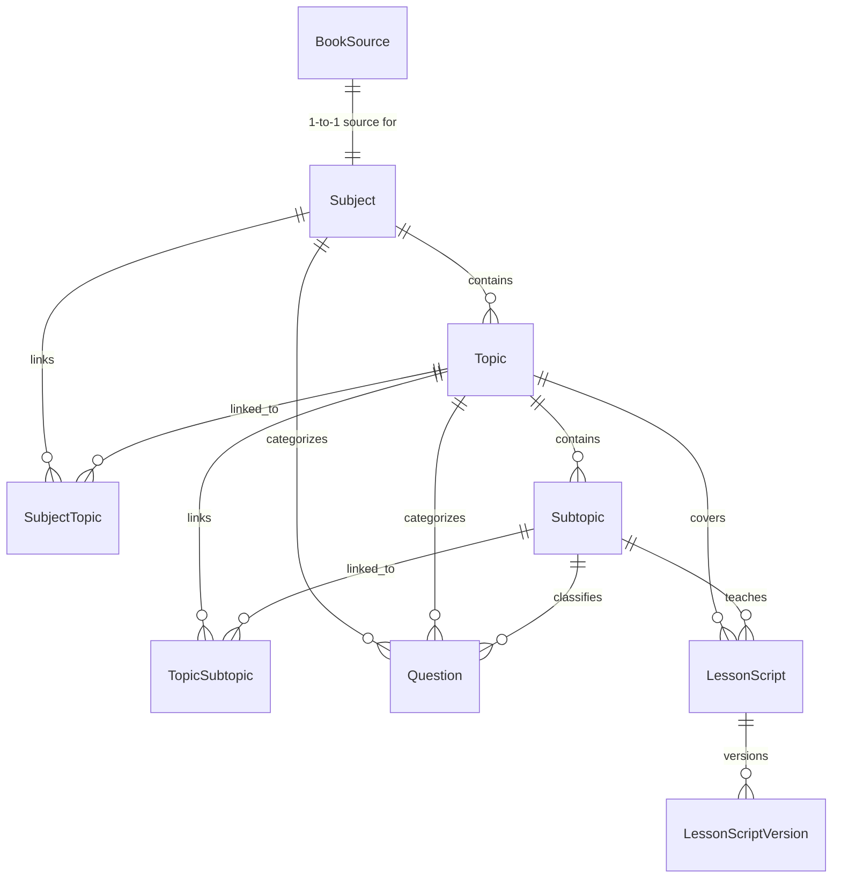
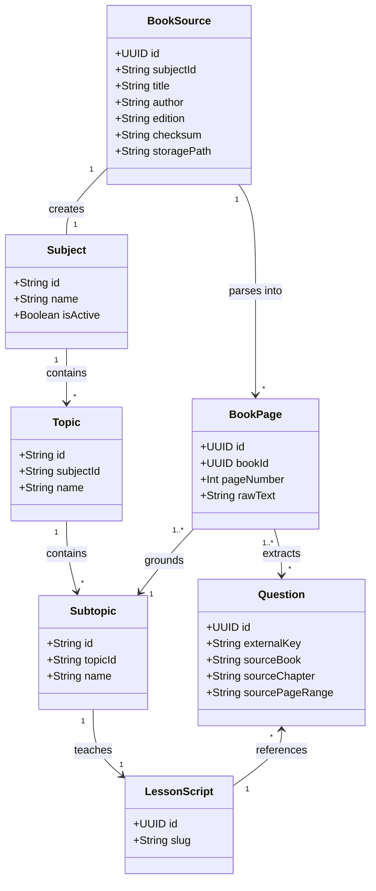

# AptiQu Educational Book Content Ingestion Engine
## Production-Ready Architectural Design & End-to-End Implementation Plan

---

## 1. Executive Summary

This document specifies the production-ready architecture, data pipelines, queue workflows, database schemas, AI interactions, administrative interfaces, and operational guardrails for the **AptiQu Book Content Ingestion Engine**.

### 1.1 Core Conceptual Model: Uploaded Book = AptiQu Subject
The fundamental architectural principle of this module is:

> **Every uploaded educational book PDF becomes a distinct AptiQu `Subject`.**

In the book ingestion workflow, an uploaded book is not merged into a pre-existing academic discipline, nor does the administrator select a `targetSubjectId`. Instead, the book itself is the curriculum container:

```text
Uploaded PDF:
R.S. Aggarwal Quantitative Aptitude
                ↓
AptiQu Subject (created by ingestion):
R.S. Aggarwal Quantitative Aptitude
                ↓
Topics (Book Chapters):
Number System, Percentage, Profit & Loss, Time & Work...
                ↓
Subtopics (Pedagogical Concept Units):
NS-01, NS-02, NS-03...
                ↓
Interactive Lesson Scripts + Question Bank
```

This model provides clean separation:
- **`Subject`**: The official AptiQu curriculum container created from the uploaded book, containing all its topics, subtopics, lessons, and questions.
- **`BookSource`**: The source/ingestion record maintaining a strict **1-to-1 relationship** with the `Subject`, tracking the physical PDF, storage path, SHA-256 checksum, page-level parsed data, extraction state machine, and administrative review checkpoints.

### 1.2 Objective
Transform a complete educational book PDF (e.g., *R.S. Aggarwal Quantitative Aptitude*, 500–1,000+ pages, 10–50+ MB) into structured, high-pedagogy AptiQu content:
1. **Curriculum Hierarchy**: Book $\rightarrow$ `Subject` $\rightarrow$ Major Topics (Chapters) $\rightarrow$ Teachable Subtopics (Pedagogical Concept Units).
2. **Content-Driven Subtopics**: Subtopics are formed around meaningful conceptual units (concepts, methods, formula groups, speed tricks, distinct problem classes). Granularity is determined strictly by source depth (a topic may contain 1, 3, 8, 13, or 20+ subtopics—no arbitrary minimums or maximums).
3. **Interactive Lesson Scripts**: Deterministic lesson scripts adhering strictly to the existing AptiQu Lesson Script DSL (`schemaVersion: 1`), referencing questions by immutable external keys.
4. **Question Repository**: Faithfully extracted source questions with MCQ options, official solutions, derived step-by-step explanations, speed shortcuts (`alternativeExplanation`), hints, difficulty ratings, calculation modes, and strict Previous Year Question (`pyq`) attributions.
5. **Seamless Integration**: Zero breaking changes to the learner runtime (Flutter client, Lesson Player, Ranked PvP, Practice Sessions, Daily Streak Engine). Once published/activated, the book Subject is immediately consumable by the entire existing application.

### 1.3 Core Architectural Invariant: Strict Content Grounding
The uploaded book is the **sole authoritative source of truth**. The system must never use web search, browse external educational portals, hallucinate shortcuts, or import external knowledge. The reasoning of LLMs is confined strictly to:
- Parsing, OCR correction, and Markdown structuring of source pages.
- Synthesizing, organizing, and explaining concepts present in the text.
- Deriving step-by-step worked solutions for questions when the textbook only provides an answer key.
- Generating didactic hints when absent in the source.
- Formatting into AptiQu's interactive conversational DSL.

---

## 2. Existing Architecture Audit

### 2.1 Backend Framework & Project Organization
- **Runtime & Language**: Node.js v20+ with TypeScript 5.8+, executed via `tsx watch` during development and compiled to `dist/server.js` via `tsc`.
- **Framework**: Express 4.21.2 (`backend/src/app.ts`, `backend/src/server.ts`).
- **Module Structure**: Modular monolith located in `backend/src/modules/`:
  - `admin/`: Admin controllers, services, middleware, routes (`admin.routes.ts`, `admin-questions.service.ts`, `admin-syllabus.service.ts`, `admin-ai-prompts.controller.ts`).
  - `ai/`: Gemini SDK integration (`gemini.provider.ts`), prompt repository (`prompts/`), generation services (`question-generation.service.ts`, `daily-challenge-generation.service.ts`, `pvp-set-generation.service.ts`).
  - `lesson/`: Interactive lesson execution, session tracking, script validation (`engines/script-validator.ts`), caching (`services/script-cache.service.ts`), question hydration (`services/question-hydration.service.ts`), Redis integration (`services/redis.service.ts`).
  - `curriculum/`: Syllabus visibility, live verification (`services/live-curriculum.service.ts`).
  - `roadmap/`: Learning path progression and syllabus-roadmap synchronization (`services/roadmap-progression.service.ts`).
  - `question/`: Fingerprinting (`services/fingerprint.service.ts`), structural validation (`validators/question-structural.validator.ts`), types (`domain/question.types.ts`).
  - `concurrency/`: Distributed Redis locking (`concurrency-lock.service.ts`).
  - `daily-challenge/`, `practice/`, `pvp/`, `user/`, `xp/`, `auth/`.

### 2.2 API Architecture & Authentication
- **Base Routing**: All routes mount under `/api/v1` in `backend/src/app.ts`:
  - Public/Student Auth: `/api/v1/auth`, `/api/v1/user`, `/api/v1/lessons`, `/api/v1/roadmaps`, `/api/v1/practice`, `/api/v1/pvp`, `/api/v1/daily-challenge`.
  - Admin Console: `/api/v1/admin` (governed by `admin.routes.ts`).
- **Admin Authentication**: Bearer JWT tokens signed with `ENV.ADMIN_JWT_SECRET` (24-hour expiration) containing `{ username, role: 'ADMIN' }`. Validated by `authenticateAdmin` in `backend/src/modules/admin/admin.middleware.ts`.
- **Learner Authentication**: Bearer JWT access tokens (15m expiration) + refresh tokens stored in DB (`auth.refresh_tokens`).

### 2.3 File Uploads & Storage Architecture
- **Current State**: Currently, no dedicated multipart upload middleware (such as `multer`) is installed in `backend/package.json`.
- **Existing Request Limits**: Global body parsers in `backend/src/app.ts` configure `express.json({ limit: '50mb' })` and `express.urlencoded({ limit: '50mb', extended: true })`.
- **Storage**: No external cloud bucket (S3/GCS) is presently mounted. Book assets currently reside in the workspace filesystem under `books/` (e.g., `books/r-s-aggarwal-quantitative-aptitude-for-competitive-examinations-pr_b93f895b533ef87247c379175b251de2.pdf` [13 MB] and `books/Scripts/RS Aggarwal/`).

### 2.4 Background Jobs & Worker Architecture
- **Queue Engine**: BullMQ 6.3.11 with `ioredis` 6.0.0 (`backend/src/queues/content-generation.queue.ts`).
- **Connection**: Managed via `parseRedisConnection(ENV.REDIS_URL)` with auto-reconnect and offline error suppression.
- **Existing Worker**: `contentGenWorker` runs on queue `content-generation` with `concurrency: 2` to strictly adhere to Gemini rate limits.
- **Lifecycle**: Queues and workers are initialized at boot in `backend/src/server.ts` and gracefully closed on `SIGINT`/`SIGTERM`.
- **Cron Jobs**: `node-cron` triggers scheduled tasks in `backend/src/server.ts` (e.g., 12:00 AM IST daily streak maintenance, 11:00 PM IST daily challenge pre-warming).

### 2.5 Logging, Errors & Environment
- **Configuration**: Loaded via `dotenv` in `backend/src/config/env.ts` with strict `requiredEnv` assertions for production keys.
- **Database Client**: Singleton Prisma client in `backend/src/config/prisma.ts`.
- **Logging**: HTTP request logger in `app.ts` logging method, path, status, and execution duration.

### 2.6 AI Integration Architecture
- **SDK**: Official `@google/genai` (v2.24.0) SDK wrapped in singleton `GeminiProvider` (`backend/src/modules/ai/gemini.provider.ts`).
- **Methodology**: Native structured JSON generation via `responseSchema` and `responseMimeType: 'application/json'`.
- **Thinking Configuration**: Dynamic `thinkingBudget` (controlled via `ENV.GEMINI_THINKING_BUDGET`).
- **Model Selection**: Defaults to `ENV.GEMINI_MODEL || 'gemini-3.5-flash-lite'`.
- **Dynamic Prompts**: Managed via `AiPrompt` model (`learning.ai_prompts`) and `AiPromptService`, allowing drafts, versioning, and live publishing of system instructions without redeploying code.

---

## 3. Existing Database & Data Model Audit

The database runs on PostgreSQL using Prisma Multi-Schema (`schemas: ["auth", "users", "gamification", "learning"]`). All curriculum, lesson, and question models reside in the `learning` schema.



### 3.1 Entity Analysis

| Model | Schema & Table | Key Fields | Semantic Role in Book Ingestion |
|---|---|---|---|
| `Subject` | `learning.subjects` | `id` (String PK), `slug`, `name`, `description`, `displayOrder`, `isActive` | **The Book Curriculum Container**. Created when a book is uploaded (e.g., `id: "rs-aggarwal-quantitative-aptitude"`). Remains `isActive: false` during ingestion and switches to `isActive: true` upon final admin publish. |
| `Topic` | `learning.topics` | `id` (String PK), `subjectId` (FK), `slug`, `name`, `sequence`, `defaultImportance`, `defaultTeachingDepth`, `defaultTeachingMinutes` | **Major Chapter from the Book** (e.g., `Number System`, `Time and Distance`, `Percentage`). Belongs directly to the book `Subject`. |
| `Subtopic` | `learning.subtopics` | `id` (String PK), `topicId` (FK), `slug`, `name`, `sequence`, `importance`, `teachingDepth`, `teachingMinutes` | **Teachable Concept Unit** (e.g., `ns-01-place-value-notation`). Content-driven granularity (1 to 20+ per topic). |
| `SubjectTopic` | `learning.subject_topics` | `id` (UUID), `subjectId`, `topicId`, `sequence` | Reusability join table (can link book topics to other custom curricula if desired, but direct `topic.subjectId` is primary). |
| `TopicSubtopic` | `learning.topic_subtopics` | `id` (UUID), `topicId`, `subtopicId`, `sequence` | Reusability join table for subtopic sequences. |
| `LessonScript` | `learning.lesson_scripts` | `id` (UUID), `slug` (Unique), `title`, `subjectId`, `topicId`, `subtopicId`, `status`, `publishedVersionId` | Root metadata container for an interactive pedagogical lesson teaching a subtopic. |
| `LessonScriptVersion` | `learning.lesson_script_versions` | `id` (UUID), `scriptId` (FK), `versionNumber`, `schemaVersion` (1), `definition` (JsonB), `checksum` (SHA-256), `status` | Immutable versioned JSON definition conforming to the AptiQu Lesson Script DSL. |
| `Question` | `learning.questions` | `id` (UUID), `subjectId`, `topicId`, `subtopicId`, `conceptId`, `pattern`, `prompt`, `questionType` ("MCQ"), `options` (JsonB), `correctAnswer`, `hints` (JsonB), `explanation`, `method`, `difficulty`, `estimatedTimeSeconds`, `calculationMode`, `sourceType`, `status`, `fingerprint` (Unique), `externalKey` (Unique), `generationMethod`, `sourceBook`, `sourceEdition`, `sourceChapter`, `sourcePageRange`, `pyq`, `alternativeExplanation`, `preferredSolution`, `preferredReason` | Universal question bank. Questions extracted from the book are linked to `subjectId`, `topicId`, and `subtopicId`, with full textbook provenance and dual solutions. |
| `BookSource` *(New)* | `learning.book_sources` | `id` (UUID), `subjectId` (Unique FK), `title`, `author`, `edition`, `isbn`, `storagePath`, `fileSizeBytes`, `fileChecksum`, `totalPages`, `status`, `metadata` | Ingestion & physical source metadata. Maintains an explicit **1-to-1 relation** with the created `Subject`. |
| `BookPage` *(New)* | `learning.book_pages` | `id` (UUID), `bookId` (FK), `pageNumber`, `rawText`, `cleanedMarkdown`, `hasImages`, `hasFormulas`, `tokenCount` | Extracted page-level text, markdown, and structural indicators. |
| `BookProcessingJob` *(New)* | `learning.book_processing_jobs` | `id` (UUID), `bookId` (FK), `stage`, `stageProgress`, `totalItems`, `completedItems`, `failedItems`, `details` | BullMQ background progress and error tracking per stage. |

---

## 4. Existing Script Generation & Question Bank Audit

### 4.1 Script DSL Format (`ScriptDefinition`)
Defined in `backend/src/modules/lesson/interfaces/script-dsl.interface.ts`:
```json
{
  "schemaVersion": 1,
  "scriptId": "script-ns-01-place-value-notation",
  "version": 1,
  "sourceType": "MANUAL",
  "entryNodeId": "node-1",
  "metadata": {
    "title": "Place Value, Face Value & Number Formation",
    "targetDurationMinutes": 10,
    "description": "Build fluency with positional notation and digit values."
  },
  "nodes": {
    "node-1": {
      "id": "node-1",
      "type": "CONTENT",
      "content": {
        "text": "Start with what every later shortcut depends on: the position of a digit.",
        "avatarPersona": "TUTOR"
      },
      "transitions": [{ "targetNodeId": "node-2" }]
    },
    "node-2": {
      "id": "node-2",
      "type": "QUESTION",
      "content": { "text": "Let's check whether you can locate a digit's actual value." },
      "questionReference": {
        "mode": "QUESTION_EXTERNAL_ID",
        "externalId": "ns-q-001"
      },
      "transitions": [{ "targetNodeId": "node-3" }]
    },
    "node-3": {
      "id": "node-3",
      "type": "COMPLETION",
      "content": { "text": "Great job. Positional notation is now clear." },
      "transitions": []
    }
  }
}
```

### 4.2 Script Invariants Enforced by the Codebase
- **Validation Engine**: `ScriptValidator.validate(def)` in `backend/src/modules/lesson/engines/script-validator.ts`:
  - `schemaVersion` must equal `1`.
  - `entryNodeId` must exist in `nodes`.
  - Every node ID key must match `node.id`.
  - Every transition `targetNodeId` must point to a declared node.
  - At least one node must have `type: 'COMPLETION'`.
  - If node has `type: 'QUESTION'`, it must specify `questionReference`. When `mode: 'QUESTION_EXTERNAL_ID'`, `externalId` is strictly required.
- **Hydration Gate**: `QuestionHydrationService` in `backend/src/modules/lesson/services/question-hydration.service.ts`:
  - Scans all `QUESTION` nodes referencing questions via `QUESTION_EXTERNAL_ID`.
  - Performs a single batched query to PostgreSQL.
  - **Enforces strict existence**: If any referenced question key is missing from the database, the import immediately fails with a descriptive error.
  - **Enforces topic/subtopic ownership**: Verified in `AdminSyllabusService.importScript`: the referenced question must belong to the exact same topic and subtopic as the script.
- **Client Playback**: The Flutter client (`lib/features/lesson/`) consumes hydrated scripts from `/api/v1/lessons/sessions`, rendering tutor avatar cards, choice options, and question cards without knowing whether the script was generated or handwritten.

### 4.3 Existing Question Schemas & Import Integrity
- **Question Structure**: Defined in `QuestionOption` (`{ id: 'A' | 'B' | 'C' | 'D', text: string }`), `QuestionDifficulty` (`EASY`, `MEDIUM`, `HARD`), `CalculationMode` (`MENTAL`, `LIGHT_PEN_AND_PAPER`, `PEN_AND_PAPER`).
- **Deduplication Engine**: `FingerprintService.computeFingerprint(prompt, options)` computes a normalized SHA-256 hash across prompt text and sorted option texts.
- **Bulk Import Service**: `AdminQuestionsService.bulkImport` (`backend/src/modules/admin/admin-questions.service.ts`):
  - Resolves target subtopics by `externalSubtopicKey`, `slug`, or `id`.
  - Deduplicates within the incoming batch.
  - Batches database checks in chunks of 200 to prevent database query degradation.
  - Aborts completely (0 records written) if any duplicate `externalKey` or `fingerprint` is detected.

---

## 5. Existing Admin & Frontend Architecture Audit

- **Framework**: React 18.3.1 with Vite 5.4.14 (`admin-dashboard/`).
- **Styling**: Curated custom CSS (`admin-dashboard/src/index.css`) adhering to modern Material Dashboard dark/light aesthetics with CSS custom properties.
- **Layout**: `AdminLayout.tsx` (`admin-dashboard/src/components/layout/AdminLayout.tsx`) with left sidebar navigation:
  - Dashboard (`/dashboard`)
  - Syllabus (`/syllabus`)
  - Question Bank (`/questions`)
  - AI Prompts (`/ai-prompts`)
  - Users (`/users`)
- **API Client**: Axios instance in `admin-dashboard/src/services/api.ts` with auto-injected Bearer tokens from `localStorage.getItem('aptiqu_admin_token')` and automatic redirect to `/login` on 401s.
- **Patterns**: Modal-based dialogs, syllabus tree views, and XLSX/JSON file pickers.

---

## 6. Proposed Architecture

```
                    ┌──────────────────────────────────────────────┐
                    │            Admin Dashboard (Vite)            │
                    │   BooksPage: Upload / Review / Publish       │
                    └──────────────────────┬───────────────────────┘
                                           │ Multipart POST
                                           │ (file, title, author, edition)
                                           ▼
                    ┌──────────────────────────────────────────────┐
                    │      Express API (/api/v1/admin/books)       │
                    │  Creates BookSource ──(1-to-1)──► Subject   │
                    └──────────────────────┬───────────────────────┘
                                           │ Enqueue Job
                                           ▼
                    ┌──────────────────────────────────────────────┐
                    │        BullMQ: book-ingestion Queue          │
                    │         Worker Concurrency: 1-2              │
                    └──────┬───────────────┬───────────────┬───────┘
                           │               │               │
                           ▼               ▼               ▼
                   Stage 1: Parsing  Stage 2: Detect Stage 3: Scripts &
                   & Structuring     Topics/Subtopics Questions
                           │               │               │
                           ▼               ▼               ▼
                    ┌──────────────────────────────────────────────┐
                    │           Parsed Source Cache Layer          │
                    │  storage/books/<id>/pages/page_NNNN.json     │
                    └──────────────────────┬───────────────────────┘
                                           │
                                           ▼
                    ┌──────────────────────────────────────────────┐
                    │    Gemini 2.5 / 3.5 AI Extraction & Review   │
                    │      (Strict Grounding, No Web Search)       │
                    └──────────────────────┬───────────────────────┘
                                           │
                                           ▼
                    ┌──────────────────────────────────────────────┐
                    │          Verification & Quality Gate         │
                    │   Structural Validation + Cross-Check        │
                    └──────────────────────┬───────────────────────┘
                                           │ Admin Publish / Activation
                                           ▼
                    ┌──────────────────────────────────────────────┐
                    │        PostgreSQL Database (Prisma)          │
                    │  learning.subjects (isActive: true)          │
                    │  learning.topics, subtopics, scripts, quests │
                    └──────────────────────┬───────────────────────┘
                                           │
                                           ▼
                    ┌──────────────────────────────────────────────┐
                    │          AptiQu Learner Applications         │
                    │  Flutter App / Daily Challenge / PvP / Lesson│
                    └──────────────────────────────────────────────┘
```

### 6.1 Architectural Tenets
1. **Book = Subject**: Uploading a book automatically creates its `Subject`. No `targetSubjectId` is selected, and no merging into pre-existing academic subjects occurs.
2. **BookSource $\leftrightarrow$ Subject 1-to-1 Contract**: `BookSource` models ingestion provenance and technical metadata; `Subject` is the standard AptiQu curriculum container.
3. **Additive Schema Only**: Existing models (`Subject`, `Topic`, `Subtopic`, `LessonScript`, `Question`) remain intact. We introduce only `BookSource`, `BookPage`, and `BookProcessingJob`.
4. **Decoupled Asynchronous Processing**: The upload handler creates the `BookSource` and inactive `Subject`, stores the file, enqueues the background job, and returns HTTP 202 Accepted.
5. **Parse Once, Query Infinitely**: Raw PDFs are converted into page-level structured JSON artifacts once.
6. **Deterministic Keying**: Stable identifiers are generated by the backend (e.g., `rs-ns-01`, `rs-ns-q-001`).
7. **Human-in-the-Loop Review**: Administrators can inspect and adjust detected Chapter boundaries and Subtopics before generating lessons and publishing the Subject.
8. **Decoupled Roadmaps**: The ingestion module's sole responsibility is creating the complete, published Book Subject. Mapping topics into exam-specific roadmaps (SSC, CAT, etc.) is a separate post-publish option using existing syllabus reusability features.

---

## 7. End-to-End Processing Pipeline

```
[1. Upload & Validation] ──> [2. Create BookSource & Subject] ──> [3. PDF Page Extraction]
                                                                          │
                                                                          ▼
[4. Topic Detection (Chapters)] <── (TOC or Content Analysis) ──> [Admin Topic Review]
             │
             ▼
[5. Subtopic Discovery] ──> [Concept/Trick Mapping] ──> [Admin Subtopic Review]
             │
             ▼
[6. Question Extraction] ──> [Answer/Hint Derivation] ──> [Question-Subtopic Mapping]
             │
             ▼
[7. Script Generation] ──> (DSL Construction & Question Hydration)
             │
             ▼
[8. Automated Validation Gate] ──> (Math Check + Formula Coverage)
             │
             ▼
[9. Admin Review & Subject Activation] ──> (Subject isActive = true, Live for Learners)
```

| Stage | Responsible Service | Input | Output | Parallelizable | AI vs Deterministic |
|---|---|---|---|---|---|
| **1. Upload & Validation** | `BookStorageService` | Multipart PDF stream | `BookSource` & `Subject` records, PDF on disk | No | Deterministic |
| **2. PDF Extraction** | `PdfParserService` | Local PDF file | `BookPage` records, page text, metadata | Yes (Page chunks) | Deterministic + OCR fallback |
| **3. Intermediate Representation** | `DocumentRepresentationService` | Raw page text/blocks | Structured page JSONL cache | Yes | Deterministic formatting |
| **4. Topic Detection** | `TopicDiscoveryService` | Front-matter pages (TOC) or full text sample | Proposed `Topic` records under the book `Subject` | No | AI Structured Generation |
| **5. Subtopic Discovery** | `SubtopicDiscoveryService` | Topic source pages | Proposed `Subtopic` records under each `Topic` | Yes (Per Topic) | AI Structured Generation |
| **6. Question Extraction** | `QuestionExtractionService` | Topic exercise pages | Extracted `Question` records with answers, hints, solutions | Yes (Page batches) | AI Structured Generation |
| **7. Question Linking** | `QuestionClassificationService` | Questions + Subtopic list | Questions mapped to exact `subtopicId` | Yes | Hybrid (Page proximity + AI) |
| **8. Script Generation** | `BookScriptGenerationService` | Subtopic source text + mapped questions | Complete `ScriptDefinition` JSON (`schemaVersion: 1`) | Yes (Per Subtopic) | AI Structured Generation |
| **9. Validation & Publish** | `BookPublishingService` | Draft scripts + questions | `Subject.isActive = true`, all items marked `PUBLISHED` | Yes (Per Subtopic) | Deterministic + Review Pass |

---

## 8. PDF Ingestion Strategy (Large File Handling)

### 8.1 Upload Mechanics
- **Multipart Upload**: Use `multer` disk storage to stream uploads directly to temporary disk storage (`backend/storage/temp/`), preventing V8 heap exhaustion on 50–100 MB files.
- **Upload Endpoint**: `POST /api/v1/admin/books/upload` accepting:
  - `file`: PDF binary.
  - `title`: Book title (e.g., "Quantitative Aptitude for Competitive Examinations").
  - `author`: Author name (e.g., "R.S. Aggarwal").
  - `edition`: Edition/year (e.g., "2024 Revised Edition").
  - `isbn`: Optional ISBN.
- **Subject Creation**: Upon upload, the backend immediately derives a unique slug and creates:
  1. A `Subject` with `name = title`, `slug = derived-slug`, `isActive = false`.
  2. A `BookSource` with `subjectId = subject.id`, `title`, `author`, `edition`, `storagePath`, `fileChecksum`.

### 8.2 File Validation & Security
1. **Magic Number Verification**: Read the first 4 bytes of the buffer to verify the `%PDF` header (`0x25 0x50 0x44 0x46`).
2. **SHA-256 Checksum**: Compute file hash in a single streaming pass. If a `BookSource` with the same checksum exists, return the existing book ID (idempotent re-upload).
3. **Encryption Check**: Inspect PDF catalog for `/Encrypt`. If password-protected, reject immediately.
4. **Permanent Storage**: Relocate file to `backend/storage/books/{bookId}/original.pdf`.

---

## 9. AI-Ready Document Representation

Raw PDFs are converted once into structured JSON files:
- **Primary Text Parser**: `pdf-parse` (or `@cyber2024/pdf-parse-fixed` / `pdf2json`) for text-based PDFs to extract text, coordinates, and font sizes.
- **Scanned / Image Fallback**: When page text density is below 50 characters per page, trigger `/opt/homebrew/bin/tesseract` or Gemini 2.5 Flash Vision.
- **Page Directory Structure**:
  ```
  backend/storage/books/{bookId}/
  ├── original.pdf
  ├── metadata.json
  ├── pages/
  │   ├── page_0001.json
  │   ├── page_0002.json
  │   └── page_0450.json
  └── parsed_book.jsonl
  ```

### Page JSON Schema (`BookPageDefinition`)
```json
{
  "bookId": "a1b2c3d4-...",
  "pageNumber": 14,
  "rawText": "Chapter 1: Number System\nPlace Value and Face Value...",
  "cleanedMarkdown": "## Chapter 1: Number System\n\n### Place Value and Face Value\nIn a numeral, the face value...",
  "hasImages": false,
  "hasFormulas": true,
  "hasTables": false,
  "headingCandidates": ["Chapter 1: Number System", "Place Value and Face Value"],
  "questionCountEstimate": 0,
  "tokenCount": 384
}
```

---

## 10. Topic Detection (Major Chapters)

### 10.1 Case A: Book Contains Table of Contents (TOC)
1. **TOC Page Identification**: Scan pages 1 through 30 for keywords: `Contents`, `Table of Contents`, `Index`.
2. **TOC Parsing**: Pass TOC text to Gemini using structured output to extract chapter titles, start pages, and end pages.
3. **Boundary Verification**: Verify chapter boundaries by checking that `startPage` contains the chapter heading. Correct front-matter Roman numeral page offsets automatically.

### 10.2 Case B: Book Has No Usable TOC
1. **Structural Clustering**: Scan page headings matching uppercase or numeric chapter patterns (`CHAPTER`, `SECTION`).
2. **Semantic Boundary Detection**: LLM evaluates candidate markers across the book to propose contiguous topic page ranges.

### 10.3 Topic Candidate Contract
```json
{
  "topics": [
    {
      "code": "NS",
      "name": "Number System",
      "suggestedSlug": "number-system",
      "startPage": 1,
      "endPage": 45,
      "description": "Fundamental properties of numbers, divisibility, factors, and remainders.",
      "confidence": 0.98
    }
  ]
}
```

---

## 11. Subtopic Discovery (Content-Driven Concept Units)

### 11.1 Pedagogical Clustering (No Arbitrary Count Limits)
Subtopics represent natural, teachable mathematical units. The system does **not** enforce arbitrary minimum or maximum subtopic counts:
- A compact chapter may legitimately contain **1 to 3 subtopics**.
- A standard chapter may contain **4 to 8 subtopics**.
- A comprehensive master chapter (e.g., Number System in RS Aggarwal) may contain **12 to 20+ subtopics**.
- Subtopics must never be created merely because a paragraph changed or a decorative heading appeared.
- Genuinely distinct concepts (e.g., "Divisibility Rules" vs. "Unit Digit Cycles") must never be artificially merged just to stay under an arbitrary ceiling.

### 11.2 Deterministic Keying Strategy
The backend assigns stable identifiers:
- Book Slug: Derived from book title (e.g., `rs-aggarwal-qa`).
- Topic Slug: Derived from chapter name (e.g., `number-system`).
- Subtopic Key: `{topic_slug}-{sequence}` $\rightarrow$ e.g., `ns-01-place-value-notation`, `ns-02-number-types-and-rationality`.

---

## 12. Concept, Formula & Speed-Trick Extraction

Before generating lesson scripts, the system extracts key teaching components for each subtopic:
1. **Core Concepts**: Theoretical principles (e.g., positional notation, decimal expansion).
2. **Authoritative Formulas**: Exact mathematical formulas from the text (e.g., $Dividend = (Divisor \times Quotient) + Remainder$).
3. **Speed Shortcuts / Tricks**: Mental shortcuts explicitly documented in the book (e.g., power cycles for unit digits).
4. **Negative Constraint**: Strictly forbid introducing external tricks (Vedic math, internet shortcuts) unless printed in the uploaded source.

---

## 13. Question Extraction & Structuring

### 13.1 Extraction Scope
Textbooks typically present questions in:
1. **Worked Examples**: Accompanied by full solutions inside chapter explanations.
2. **Exercise Sets**: Grouped at the end of the chapter, followed by an Answer Key and Solutions section.

### 13.2 Multipage Stitching Engine
Links exercises on pages 25–38 with the Answer Key on page 39 and Solutions on pages 40–45 by matching question numbers (`Q. 1`, `Q. 2`, etc.).

### 13.3 Question JSON Representation
Adheres strictly to AptiQu's `Question` schema:
```json
{
  "externalQuestionKey": "ns-q-001",
  "externalSubtopicKey": "ns-01-place-value-notation",
  "pattern": "PLACE_VALUE",
  "prompt": "In 3,254,710, what is the place value of the digit 5?",
  "questionType": "MCQ",
  "inputType": "SINGLE_SELECT",
  "calculationMode": "MENTAL",
  "difficulty": "EASY",
  "estimatedTimeSeconds": 20,
  "options": [
    { "id": "A", "text": "5" },
    { "id": "B", "text": "10,000" },
    { "id": "C", "text": "50,000" },
    { "id": "D", "text": "54,710" }
  ],
  "correctAnswer": "C",
  "hints": ["Locate the digit 5 from the right.", "Multiply 5 by its positional power of 10."],
  "pyq": "CLAT (2010)",
  "method": "Place value = digit × 10^(position - 1)",
  "explanation": "In 3,254,710, the digit 5 is in the ten-thousands place: 5 × 10,000 = 50,000.",
  "alternativeExplanation": "Count digits to the right of 5: there are 4 digits, so append four zeros to 5 = 50,000.",
  "preferredSolution": "ALTERNATIVE",
  "preferredReason": "Direct position lookup avoids expanding the entire number.",
  "sourceType": "MANUAL",
  "status": "PUBLISHED",
  "provenance": {
    "sourceBook": "Quantitative Aptitude for Competitive Examinations",
    "sourceEdition": "2024 Revised Edition",
    "sourceChapter": "Number System",
    "sourcePageRange": "p. 14"
  }
}
```

---

## 14. Answer, Explanation & Hint Processing Matrix

| Source Scenario | Extraction Behavior | AI Augmentation Policy | Flag for Review? |
|---|---|---|---|
| **Question + Options + Answer + Solution + Hint** | Extract directly from source | Preserve textbook method in `explanation`. Synthesize `alternativeExplanation` only if a superior speed trick exists. | No |
| **Question + Options + Answer + Solution (No Hint)** | Extract from source | AI derives 1–2 progressive didactic hints (Hint 1: Conceptual trigger; Hint 2: Formula setup). | No |
| **Question + Options + Answer (No Solution)** | Extract Question & Answer Key | AI solves the problem step-by-step to generate `explanation` and `method`. | No |
| **Question + Options (No Answer Key or Solution)** | Extract Question text | AI solves problem independently. Validates answer against all 4 options. | Yes (`REVIEW_REQUIRED`) |
| **Ambiguous / Unclear Answer Key in Book** | Extract raw text | Flag discrepancy. Do not overwrite blindly. | Yes (`REVIEW_REQUIRED`) |
| **AI Solution Disagrees with Printed Answer Key** | Keep printed answer in `rawAnswer` | Flag error. Set question `status: 'REVIEW'`. | Yes (Hard Flag) |

---

## 15. Question-to-Subtopic Classification

1. **Source Page Proximity (Deterministic)**: If a question appears in a worked example on page 14, and Subtopic `ns-01` covers pages 12–16, map directly to `ns-01`.
2. **Constrained Topic Candidate Classification (AI)**: For end-of-chapter exercises, prompt Gemini with the question text and *only* the subtopics established for that specific chapter.
3. **Confidence Scoring**: Each mapping produces a confidence score ($0.00$ to $1.00$). Any mapping with confidence $< 0.80$ is flagged for administrative review.

---

## 16. Script Generation (Source-Scoped DSL)

Scripts must conform to `ScriptDefinition` (`schemaVersion: 1`).

### 16.1 Source-Scoped Context Window
To generate a lesson script for `ns-01-place-value-notation`:
- Retrieve only the text of pages mapped to `ns-01` (e.g., pages 1–4).
- Retrieve the extracted concepts, formulas, and tricks for `ns-01`.
- Retrieve the IDs and prompts of the 3–5 easiest questions classified under `ns-01`.
- Total prompt context is strictly bounded to ~2,000 tokens (fast, cost-effective, deterministic).

### 16.2 Script Node Topology
AptiQu lesson scripts follow a standard interactive cadence:
1. `node-1` (`CONTENT`): Tutor introduces the foundational concept using conversational, direct language.
2. `node-2` (`CONTENT`): Tutor illustrates the core rule or speed shortcut.
3. `node-3` (`QUESTION`): Inline interactive check referencing the first subtopic question via `QUESTION_EXTERNAL_ID`.
4. `node-4` (`CONTENT`): Tutor reinforces common traps or explains why standard algebra is too slow.
5. `node-5` (`QUESTION`): Second interactive check referencing another subtopic question.
6. `node-6` (`COMPLETION`): Tutor wraps up key takeaways and concludes the lesson.

---

## 17. Multi-Layer Validation & Quality Control

```
Generated Artifact (Script / Question)
                 │
                 ▼
[ Layer 1: Machine Validation (Deterministic) ]
  • Zod schema check (types, required fields)
  • Foreign key validation (subjectId, topicId, subtopicId exist in DB)
  • Fingerprint collision check (SHA-256)
  • Script DSL validation (entryNode, completionNode, transition graph)
                 │
                 ▼ (Pass)
[ Layer 2: Mathematical & Code Verification ]
  • Programmatic arithmetic check (evaluating formula results)
  • Option uniqueness (no duplicate option labels)
  • Correct answer index ('A', 'B', 'C', 'D' exists in options)
                 │
                 ▼ (Pass)
[ Layer 3: Semantic Grounding Gate (Independent AI Pass) ]
  • Verify script introduces NO formulas absent in source pages
  • Verify explanation matches correct option letter
  • Flag discrepancies for manual review
                 │
                 ▼ (Pass)
Database Persistence (Ready to Publish)
```

---

## 18. Provenance & Source Traceability

Every generated record preserves a digital chain of custody back to the original physical textbook page:



---

## 19. Processing State Machine

```
UPLOADED (BookSource & inactive Subject created)
   │
   ▼
VALIDATING
   │
   ▼
PARSING_PAGES ──────── (Page parsing failure) ───────────► FAILED
   │
   ▼
PAGES_EXTRACTED
   │
   ▼
DETECTING_TOPICS
   │
   ▼
TOPICS_DETECTED ────── (Optional Admin Review) ──────────► (Admin Edit)
   │                                                            │
   ▼                                                            ▼
DISCOVERING_SUBTOPICS ──────────────────────────────────────────┘
   │
   ▼
SUBTOPICS_DISCOVERED ─ (Optional Admin Review) ──────────► (Admin Edit)
   │                                                            │
   ▼                                                            ▼
EXTRACTING_QUESTIONS ───────────────────────────────────────────┘
   │
   ▼
QUESTIONS_EXTRACTED
   │
   ▼
CLASSIFYING_QUESTIONS
   │
   ▼
GENERATING_SCRIPTS
   │
   ▼
VALIDATING_CONTENT
   │
   ▼
READY_FOR_REVIEW ───── (Admin approves batch)
   │
   ▼
PUBLISHED (Subject.isActive = true, live for learners)
```

---

## 20. Queue & Worker Architecture (BullMQ)

### 20.1 Dedicated Queue: `book-ingestion`
Implemented in `backend/src/queues/book-ingestion.queue.ts` using the existing Redis connection (`parseRedisConnection(ENV.REDIS_URL)`), completely isolated from student practice generation.

### 20.2 Atomic, Resumable Sub-Jobs
1. `job:parse-book-pages`: Parses PDF into `BookPage` records.
2. `job:detect-book-topics`: Proposes topic boundaries under the book `Subject`.
3. `job:discover-topic-subtopics`: Discovers subtopics for Topic $N$.
4. `job:extract-topic-questions`: Extracts questions from Topic $N$'s pages.
5. `job:classify-topic-questions`: Links questions to subtopics.
6. `job:generate-subtopic-script`: Generates the lesson script for Subtopic $M$.
7. `job:validate-subtopic-content`: Validates script and question integrity.

### 20.3 Crash Resilience & Idempotency
- If the server restarts while processing subtopic 7, BullMQ automatically resumes from subtopic 8.
- Every subtopic script and question generation job uses a deterministic `jobId` (e.g., `book:{bookId}:script:{subtopicKey}`).

---

## 21. AI API Efficiency & Batching Strategy

1. **Source Window Bounding**: Prompts only receive the 2–8 pages assigned to that specific subtopic or question block.
2. **Gemini Batch API**: Asynchronous batch generation for bulk question extraction, cutting API costs by 50%.
3. **Structured Schemas (`responseSchema`)**: Strictly define JSON schemas to eliminate markdown wrapper parsing failures (` ```json `).
4. **Token Cache Reuse**: For topics spanning multiple subtopics, use Gemini Context Caching for the shared chapter text.

---

## 22. Model & Provider Strategy

| Task Type | Recommended Model | Rationale | Cost / Speed Profile |
|---|---|---|---|
| **OCR Cleanup & Text Normalization** | `gemini-2.5-flash` / Tesseract | High-throughput, low cost, excellent document structure recognition. | Ultra low cost, high speed |
| **TOC & Topic Boundary Detection** | `gemini-2.5-flash` | Pure structural classification from front-matter. | Very low cost |
| **Subtopic Discovery & Concept Extraction** | `gemini-2.5-flash` | Requires strong contextual synthesis across chapter pages. | Low cost |
| **Question Extraction (Bulk)** | `gemini-2.5-flash` (Batch API) | High volume, structured pattern extraction. | 50% discount via Batch API |
| **Complex Math Script Derivation** | `gemini-2.5-pro` (or Flash with Thinking Budget: 2048) | Requires deep mathematical reasoning, step-by-step verification, and educational empathy. | Moderate cost, highest accuracy |
| **Independent Validation Pass** | `gemini-2.5-flash` | Fast critique against strict negative grounding constraints. | Low cost |

---

## 23. Proposed Database Changes (Prisma Schema)

Three new models are added to the `learning` schema in `backend/prisma/schema.prisma`. Existing production models (`Subject`, `Topic`, `Subtopic`, `LessonScript`, `Question`) remain untouched.

```prisma
// =============================================================================
// BOOK INGESTION MODULE
// =============================================================================

enum BookProcessingStatus {
  UPLOADED
  VALIDATING
  PARSING_PAGES
  PAGES_EXTRACTED
  DETECTING_TOPICS
  TOPICS_DETECTED
  DISCOVERING_SUBTOPICS
  SUBTOPICS_DISCOVERED
  EXTRACTING_QUESTIONS
  QUESTIONS_EXTRACTED
  CLASSIFYING_QUESTIONS
  GENERATING_SCRIPTS
  VALIDATING_CONTENT
  READY_FOR_REVIEW
  PUBLISHED
  FAILED

  @@schema("learning")
}

model BookSource {
  id               String               @id @default(uuid()) @db.Uuid
  subjectId        String               @unique @map("subject_id")
  title            String
  author           String?
  edition          String?
  isbn             String?
  storagePath      String               @map("storage_path")
  fileSizeBytes    BigInt               @map("file_size_bytes")
  fileChecksum     String               @unique @map("file_checksum")
  totalPages       Int                  @default(0) @map("total_pages")
  status           BookProcessingStatus @default(UPLOADED)
  errorMessage     String?              @map("error_message") @db.Text
  
  // Pipeline metadata: parsed TOC, detected topic page ranges, stats
  metadata         Json                 @default("{}") @db.JsonB
  
  createdAt        DateTime             @default(now()) @map("created_at")
  updatedAt        DateTime             @updatedAt @map("updated_at")

  subject          Subject              @relation(fields: [subjectId], references: [id], onDelete: Cascade)
  pages            BookPage[]
  jobs             BookProcessingJob[]

  @@index([status])
  @@map("book_sources")
  @@schema("learning")
}

model BookPage {
  id              String      @id @default(uuid()) @db.Uuid
  bookId          String      @map("book_id") @db.Uuid
  pageNumber      Int         @map("page_number")
  rawText         String      @map("raw_text") @db.Text
  cleanedMarkdown String?     @map("cleaned_markdown") @db.Text
  hasImages       Boolean     @default(false) @map("has_images")
  hasFormulas     Boolean     @default(false) @map("has_formulas")
  hasTables       Boolean     @default(false) @map("has_tables")
  tokenCount      Int         @default(0) @map("token_count")
  createdAt       DateTime    @default(now()) @map("created_at")

  book            BookSource  @relation(fields: [bookId], references: [id], onDelete: Cascade)

  @@unique([bookId, pageNumber])
  @@index([bookId])
  @@map("book_pages")
  @@schema("learning")
}

model BookProcessingJob {
  id             String               @id @default(uuid()) @db.Uuid
  bookId         String               @map("book_id") @db.Uuid
  stage          BookProcessingStatus
  stageProgress  Float                @default(0.0) @map("stage_progress") // 0.0 to 1.0
  totalItems     Int                  @default(0) @map("total_items")
  completedItems Int                  @default(0) @map("completed_items")
  failedItems    Int                  @default(0) @map("failed_items")
  details        Json                 @default("{}") @db.JsonB
  startedAt      DateTime             @default(now()) @map("started_at")
  completedAt    DateTime?            @map("completed_at")

  book           BookSource           @relation(fields: [bookId], references: [id], onDelete: Cascade)

  @@index([bookId, stage])
  @@map("book_processing_jobs")
  @@schema("learning")
}
```

---

## 24. API Design (Admin Ingestion Endpoints)

All endpoints mount under `/api/v1/admin/books` and require admin JWT authorization (`authenticateAdmin`):

| Method | Endpoint | Description | Request Body / Query | Response |
|---|---|---|---|---|
| `POST` | `/api/v1/admin/books/upload` | Upload PDF and create BookSource + Subject | `multipart/form-data`: `file`, `title`, `author`, `edition`, `isbn` | `202 Accepted`: `{ success: true, bookId, subjectId, status }` |
| `GET` | `/api/v1/admin/books` | List all uploaded books, subjects & statuses | `?page=1&limit=10&status=...` | `200 OK`: `{ books: [...], pagination }` |
| `GET` | `/api/v1/admin/books/:id` | Full book ingestion overview & stats | None | `200 OK`: `{ book, subject, topics, subtopics, questionCount, progress }` |
| `GET` | `/api/v1/admin/books/:id/status` | Real-time progress polling endpoint | None | `200 OK`: `{ status, subjectId, currentStage, stageProgress, counts }` |
| `GET` | `/api/v1/admin/books/:id/topics` | Get detected topics & page ranges | None | `200 OK`: `{ topics: [...] }` |
| `PUT` | `/api/v1/admin/books/:id/topics` | Admin edits/approves topic hierarchy | `{ topics: [...] }` | `200 OK`: `{ success: true }` |
| `GET` | `/api/v1/admin/books/:id/subtopics` | Get discovered subtopics | `?topicId=...` | `200 OK`: `{ subtopics: [...] }` |
| `PUT` | `/api/v1/admin/books/:id/subtopics` | Admin edits/approves subtopic hierarchy | `{ subtopics: [...] }` | `200 OK`: `{ success: true }` |
| `GET` | `/api/v1/admin/books/:id/content-preview` | Preview generated scripts & questions | `?subtopicId=...` | `200 OK`: `{ script, questions: [...] }` |
| `POST` | `/api/v1/admin/books/:id/publish` | Activate Subject and mark all content live | None | `200 OK`: `{ success: true, subjectId, publishedTopics, publishedSubtopics, publishedQuestions }` |
| `POST` | `/api/v1/admin/books/:id/retry` | Retry failed stage | `{ stage?: BookProcessingStatus }` | `200 OK`: `{ success: true, enqueued: true }` |
| `DELETE` | `/api/v1/admin/books/:id` | Delete book source and unpublish subject | `?hardDeleteSubject=true` | `200 OK`: `{ success: true }` |

---

## 25. Admin Dashboard UI Changes (`admin-dashboard`)

### 25.1 Navigation Addition
In `admin-dashboard/src/components/layout/AdminLayout.tsx`:
- Add a new navigation item with the `BookOpen` icon from `lucide-react`:
  ```tsx
  <NavLink
    to="/books"
    className={({ isActive }) => `nav-item ${isActive ? 'active' : ''}`}
  >
    <BookOpen size={18} />
    <span>Book Ingestion</span>
  </NavLink>
  ```

### 25.2 New Page: `BooksPage.tsx`
1. **Upload Dropzone**: Accepts PDF up to 100 MB with metadata fields:
   - Book PDF File
   - Book Title (becomes Subject name)
   - Author Name
   - Edition / Year
   - ISBN (optional)
   *(Note: No target subject dropdown!)*
2. **Book Repository Table**: Displays ingested books, created Subject names, page counts, total questions, and status badges.
3. **Interactive Multi-Step Review Drawer**:
   - **Step 1: Chapter Boundaries**: Visual boundary editor for Topics and page ranges.
   - **Step 2: Subtopics**: Review content-driven subtopic list.
   - **Step 3: Preview**: Side-by-side view showing source pages next to generated script DSL and questions.
   - **Step 4: Activate Subject**: One-click action activating the Subject (`isActive = true`), making it live for learners.

---

## 26. Progress Tracking & Admin Observability

Polling `/api/v1/admin/books/:id/status` returns:

```json
{
  "bookId": "a1b2c3d4-...",
  "subjectId": "rs-aggarwal-quantitative-aptitude",
  "title": "R.S. Aggarwal Quantitative Aptitude",
  "status": "GENERATING_SCRIPTS",
  "overallProgressPercent": 68,
  "stages": {
    "pdfProcessing": { "status": "COMPLETED", "progress": 1.0, "totalPages": 842 },
    "topicDetection": { "status": "COMPLETED", "progress": 1.0, "totalTopics": 24 },
    "subtopicDiscovery": { "status": "COMPLETED", "progress": 1.0, "totalSubtopics": 118 },
    "questionExtraction": { "status": "COMPLETED", "progress": 1.0, "totalQuestions": 640 },
    "scriptGeneration": { "status": "IN_PROGRESS", "progress": 0.58, "completed": 68, "total": 118 },
    "validation": { "status": "PENDING", "progress": 0.0, "passed": 0, "flagged": 0 }
  },
  "currentActivity": "Generating interactive lesson script for NS-08 (Digit Puzzles & Cryptarithms)",
  "reviewFlags": {
    "ambiguousQuestions": 4,
    "lowConfidenceMappings": 2
  }
}
```

---

## 27. Failure, Retry & Idempotency Strategy

| Failure Mode | Detection | System Action | Retry Policy | Downstream Impact |
|---|---|---|---|---|
| **Malformed / Corrupt PDF** | Header validation or parser throw | Fail fast, mark status `FAILED`. Update `errorMessage`. | No retry. Alert admin. | Pipeline halts cleanly. |
| **Scanned Pages with No Embedded Text** | Character density < 50 chars/page | Automatically route pages to OCR worker (Tesseract / Gemini Vision). | 2 retries per page chunk. | Continues seamlessly. |
| **Gemini Rate Limit (429 / 503)** | HTTP status from `@google/genai` | BullMQ worker catches error and applies exponential backoff (initial delay: 5s, multiplier: 2). | 3 retries. Concurrency throttled to 2. | Pipeline pauses briefly, then resumes. |
| **LLM Output Fails JSON Schema** | `JSON.parse` fails or Zod validation fails | Discard response. Re-prompt with strict JSON instruction and low temperature (0.1). | 2 retries with thinking budget enabled. | Isolated to specific subtopic/question. |
| **Worker Process Crash (OOM / SIGKILL)** | BullMQ job stalled check | Stalled job watchdog detects orphaned job, reassigns it to active worker. | Resumes from exact last completed subtopic. | Zero duplicate records created. |
| **Duplicate Question Detection** | `FingerprintService` detects identical question in DB | Preserve original question; attach new book edition into provenance metadata. | No failure; skipped cleanly. | Pipeline continues. |

---

## 28. Security & Storage Design

### 28.1 Security
- **File Upload Protection**: Enforce strict MIME verification (`application/pdf`) and magic number validation.
- **Path Traversal Protection**: Sanitize filenames; store files under deterministic UUID directories: `backend/storage/books/{bookId}/original.pdf`.
- **Privilege Separation**: All ingestion routes require `role: 'ADMIN'`.
- **Disk Quota Safeguards**: Reject files larger than 100 MB before buffering.

### 28.2 Storage Architecture
- Ingested book PDFs and parsed intermediate JSON files live in `backend/storage/books/`:
  - `original.pdf`: Archival master copy.
  - `pages/page_NNNN.json`: Page-level extracted text and metadata.
  - `metadata.json`: Chapter boundaries and TOC structure.

---

## 29. Cost & Performance Model

### Token Consumption Framework (1,000-Page Textbook Benchmark)
- Total Pages: 1,000 pages (~500,000 words $\approx$ 650,000 tokens).
- Structure: ~25 Topics, ~120 Subtopics, ~800 Questions.

| Processing Stage | Calls & Units | Estimated Input Tokens | Estimated Output Tokens | Estimated Cost (Gemini 2.5 Flash Rates) |
|---|---|---|---|---|
| **1. Page Extraction & OCR** | 1,000 pages (Local parsing + 5% OCR) | 0 (Local) | 0 | $0.00 |
| **2. Topic Detection** | 1 call (TOC pages 1–25) | 18,000 | 2,500 | ~$0.003 |
| **3. Subtopic Discovery** | 25 calls (1 per topic, ~25 pages text) | 400,000 | 45,000 | ~$0.06 |
| **4. Question Extraction** | 50 batch calls (16 questions/call) | 600,000 | 350,000 | ~$0.15 (Batch API) |
| **5. Question Linking** | 25 batch calls (topic-scoped) | 120,000 | 25,000 | ~$0.03 |
| **6. Script Generation** | 120 calls (1 per subtopic, ~3 pages text) | 360,000 | 180,000 | ~$0.12 |
| **7. Validation Pass** | 120 calls (scripts) + 800 questions | 450,000 | 80,000 | ~$0.08 |
| **TOTALS** | **~340 Total API Calls** | **~1,948,000 Tokens** | **~682,500 Tokens** | **<$0.50 per 1,000-page book** |

---

## 30. Phase-by-Phase Implementation Plan

### Phase 1: Storage Infrastructure & Book/Subject Foundation
- **Objective**: Implement secure file upload, disk storage, `BookSource` creation, and 1-to-1 `Subject` initialization.
- **Files to Create**:
  - `backend/src/modules/admin/services/book-storage.service.ts`: File validation, SHA-256 calculation, and disk persistence.
  - `backend/src/modules/admin/services/pdf-parser.service.ts`: Extracts text, font sizes, headings, and triggers Tesseract fallback.
  - `backend/src/modules/admin/controllers/admin-books.controller.ts`: Upload and status endpoints.
  - `backend/src/modules/admin/routes/admin-books.routes.ts`: Routes mounted on `/api/v1/admin/books`.
- **Files to Modify**:
  - `backend/package.json`: Add `multer` and `@types/multer`.
  - `backend/prisma/schema.prisma`: Add `BookSource`, `BookPage`, `BookProcessingJob` models with `BookProcessingStatus` enum.
  - `backend/src/modules/admin/admin.routes.ts`: Mount `admin-books.routes.ts`.
- **Completion Criteria**: An admin can upload a 50 MB PDF; the backend verifies `%PDF`, saves the file, creates a `Subject` and `BookSource`, and parses all pages into `backend/storage/books/{id}/pages/`.

---

### Phase 2: BullMQ Book Ingestion Queue & State Machine
- **Objective**: Establish decoupled background job orchestration with live progress tracking.
- **Files to Create**:
  - `backend/src/queues/book-ingestion.queue.ts`: BullMQ queue, worker definition, failure listeners, and exponential backoff configuration.
  - `backend/src/modules/admin/services/book-job.service.ts`: State machine transition helpers, progress percentage calculators.
- **Files to Modify**:
  - `backend/src/server.ts`: Register `bookIngestionWorker` alongside `contentGenWorker` for graceful shutdown.
- **Completion Criteria**: Ingestion jobs execute asynchronously without blocking the Express event loop; the worker survives restarts and updates stage progress in `BookProcessingJob`.

---

### Phase 3: Topic & Content-Driven Subtopic Discovery
- **Objective**: Detect chapter boundaries and synthesize non-fragmented pedagogical subtopics directly under the book `Subject`.
- **Files to Create**:
  - `backend/src/modules/admin/services/topic-discovery.service.ts`: TOC parsing and fallback structural heading clustering.
  - `backend/src/modules/admin/services/subtopic-discovery.service.ts`: Content-driven subtopic synthesis (variable granularity based on material depth).
  - `backend/src/modules/admin/prompts/topic-discovery.prompt.ts`: Strict structured prompt templates.
  - `backend/src/modules/admin/prompts/subtopic-discovery.prompt.ts`: Pedagogical progression prompts without arbitrary count restrictions.
- **Completion Criteria**: The system identifies all major chapters as `Topic`s under the book `Subject` and proposes pedagogically coherent `Subtopic`s.

---

### Phase 4: Question Extraction, Linking & Dual-Solution Derivation
- **Objective**: Faithfully extract textbook questions, correlate answers and hints, synthesize alternative solutions where valuable, and map questions to subtopics.
- **Files to Create**:
  - `backend/src/modules/admin/services/book-question-extraction.service.ts`: Multi-page question and solution stitcher.
  - `backend/src/modules/admin/services/book-question-classification.service.ts`: Page proximity and topic-scoped classifier.
  - `backend/src/modules/admin/prompts/book-question-extraction.prompt.ts`: JSON schema for questions with options, PYQ, and dual solutions.
- **Files to Modify**:
  - `backend/src/modules/admin/admin-questions.service.ts`: Reuse `FingerprintService` and duplicate check helpers.
- **Completion Criteria**: Questions from the book are extracted with options, correct keys, verified solutions, and assigned `externalKey`s, mapped to their parent subtopics under the book `Subject`.

---

### Phase 5: Educational Script Generation & Question Hydration
- **Objective**: Generate interactive lesson scripts conforming to the AptiQu DSL (`schemaVersion: 1`), referencing extracted questions by external key.
- **Files to Create**:
  - `backend/src/modules/admin/services/book-script-generation.service.ts`: Prompts Gemini with subtopic source pages, constructs `ScriptDefinition`, and invokes `ScriptValidator`.
  - `backend/src/modules/admin/prompts/book-script-generation.prompt.ts`: System instruction enforcing conversational tutor tone and negative grounding constraints.
- **Files to Modify**:
  - `backend/src/modules/lesson/services/question-hydration.service.ts`: Ensure compatibility with newly generated question keys.
- **Completion Criteria**: Each subtopic receives a valid, hydrated `ScriptDefinition` that passes `ScriptValidator.validate()` with zero errors and renders smoothly in the lesson engine.

---

### Phase 6: Automated Validation Gate & Subject Activation
- **Objective**: Verify mathematical consistency, enforce strict source grounding, and activate the book `Subject`.
- **Files to Create**:
  - `backend/src/modules/admin/services/content-validation.service.ts`: Multi-layer validation (JSON schema, math verification, negative grounding check).
  - `backend/src/modules/admin/services/book-publishing.service.ts`: Transactionally updates `Subject.isActive = true` and marks all child content `PUBLISHED`.
- **Completion Criteria**: Activating the book `Subject` makes all its topics, subtopics, lessons, and questions immediately available to the learner-facing application without manual JSON manipulation.

---

### Phase 7: Admin Console UI (`admin-dashboard`)
- **Objective**: Build the visual administrative interface for uploading books, monitoring ingestion progress, and approving generated curriculum.
- **Files to Create**:
  - `admin-dashboard/src/pages/BooksPage.tsx`: Upload dropzone (no target subject dropdown), book list, progress meters, and review drawer.
  - `admin-dashboard/src/components/books/BookUploadModal.tsx`: Upload dialog for book metadata and PDF.
  - `admin-dashboard/src/components/books/BookProgressView.tsx`: Real-time stage progress breakdown.
  - `admin-dashboard/src/components/books/BookReviewDrawer.tsx`: Hierarchy approval and script previewer.
- **Files to Modify**:
  - `admin-dashboard/src/components/layout/AdminLayout.tsx`: Add "Book Ingestion" navigation link.
  - `admin-dashboard/src/services/api.ts`: Add book ingestion API client methods.
  - `admin-dashboard/src/App.tsx`: Register `/books` route.
- **Completion Criteria**: An administrator can complete the entire book ingestion workflow visually from the browser without running terminal scripts.

---

## 31. Comprehensive Testing Strategy

### 31.1 Unit Tests
- `pdf-parser.test.ts`: Verify page count detection, header/footer stripping, and font size metadata extraction.
- `fingerprint.test.ts`: Verify identical prompts with shuffled options produce the exact same fingerprint.
- `script-validator.test.ts`: Verify invalid transition IDs, missing completion nodes, or missing question references fail validation.
- `deterministic-key.test.ts`: Verify subtopic slugs and question keys follow `{prefix}-{topic}-{seq}` without collisions.

### 31.2 Integration Tests
- `book-upload-pipeline.test.ts`: Upload sample chapter PDF $\rightarrow$ verify `BookSource` and `Subject` records created $\rightarrow$ verify `BookPage` records created.
- `topic-subtopic-extraction.test.ts`: Verify candidate topics and subtopics match expected pedagogical units under the book `Subject`.
- `question-hydration.test.ts`: Verify generated script referencing `rs-ns-q-001` successfully hydrates question data from PostgreSQL.
- `idempotency.test.ts`: Re-uploading the same PDF with identical checksum returns existing record without re-running completed extraction stages.

### 31.3 Failure & Resilience Tests
- **Corrupt File**: Upload a corrupted binary $\rightarrow$ verify HTTP 400 and clean rejection.
- **AI Timeout**: Mock Gemini timeout (60s) $\rightarrow$ verify BullMQ job retries with backoff and marks job failed after 3 attempts without corrupting DB state.
- **Database Disconnect**: Disconnect PostgreSQL during script publishing $\rightarrow$ verify transaction rollback (0 orphan records created).

### 31.4 End-to-End Acceptance Test
Execute an automated test using the existing repository PDF: `books/r-s-aggarwal-quantitative-aptitude-for-competitive-examinations-pr_b93f895b533ef87247c379175b251de2.pdf`:
1. Ingest Chapter 1 ("Number System", pages 1–45).
2. Verify a new `Subject` is created: `R.S. Aggarwal Quantitative Aptitude`.
3. Verify `Number System` is created as a `Topic` under this Subject.
4. Verify meaningful subtopics are generated based on material depth (`ns-01`, `ns-02`, etc.).
5. Verify Questions are extracted with options, answers, and hints.
6. Verify Lesson Scripts are generated and hydrated with question references.
7. Publish / Activate the Subject (`isActive: true`).
8. Verify `/api/v1/lessons/active` can start an interactive lesson session for Subtopic `ns-01` under the new Subject.

---

## 32. Acceptance Criteria

- [ ] **Book = Subject**: Uploading a book creates a new AptiQu `Subject` representing that book. No target subject selection is required.
- [ ] **Large PDF Support**: Admin can upload books up to 100 MB / 1,000+ pages without blocking the Node.js event loop or exceeding server memory.
- [ ] **Strict Content Grounding**: No external formulas, tricks, or web-browsed content are introduced; all educational claims originate strictly from the uploaded PDF.
- [ ] **Existing Schema Preservation**: Zero breaking changes to `Subject`, `Topic`, `Subtopic`, `LessonScript`, `LessonScriptVersion`, or `Question`.
- [ ] **Content-Driven Subtopics**: Subtopics are formed around meaningful conceptual boundaries. No arbitrary minimum or maximum subtopic count is forced.
- [ ] **Deterministic Keying**: All subtopics and questions receive stable, human-readable external keys generated by the backend.
- [ ] **Existing Script DSL Compliance**: All generated lesson scripts strictly adhere to `schemaVersion: 1`, pass `ScriptValidator.validate()`, and hydrate questions via `QUESTION_EXTERNAL_ID`.
- [ ] **Question Fidelity**: Source question prompts, options, and answers are faithfully preserved. Hints and explanations are derived strictly when missing in source.
- [ ] **Dual Solutions**: Secondary speed shortcuts are added only when a genuine alternative method exists, producing the identical answer key.
- [ ] **Asynchronous Observability**: Ingestion progress is visible in real-time on the Admin Dashboard with stage percentages and activity logs.
- [ ] **Failure Recovery**: Pipeline is fully resumable; failed jobs can be retried without duplicating already-generated content.
- [ ] **Zero Learner Disruption**: Once the Subject is activated, content is immediately consumable by the Flutter app, Practice Sessions, Ranked PvP, and Daily Challenge engines.

---

## 33. Risks & Mitigations

| Risk | Impact | Mitigation Strategy |
|---|---|---|
| **Heavily Scanned / Low-Quality PDF** | Text parser extracts empty or garbled text | Detect low character count per page; automatically route scanned pages through Tesseract OCR or Gemini 2.5 Flash Vision. |
| **Model Hallucination of Unprinted Shortcuts** | Violates strict grounding rule | Hard prompt constraints forbidding unprinted formulas; secondary validation model checks generated content against source page text. |
| **Gemini Rate Limits During Bulk Extraction** | Job failures and pipeline stalling | Worker concurrency capped at 2; exponential backoff in BullMQ; use Gemini Batch API for bulk question processing. |
| **Roman Numeral Front-Matter Page Offset** | TOC lists page 1, but PDF page index is 15 | Compute front-matter offset delta by matching Chapter 1 heading on physical pages. |
| **Question Key Collisions on Repeated Ingestion** | Bulk import rejection | Deterministic external keys include a unique book slug prefix (e.g., `rs-ns-q-001` vs `as-ns-q-001`). |

---

## 34. Open Questions & Assumptions

1. **OCR Performance**: It is assumed that textbook PDFs provided will be primarily digital text. For scanned pages, `/opt/homebrew/bin/tesseract` is present on the host environment; multimodal Gemini Vision serves as the cloud fallback.
2. **Diagrams & Geometry Figures**: For pure quantitative arithmetic/algebra, text representations are sufficient. For geometry/mensuration questions containing diagrams, the pipeline will extract page bounding box images into `backend/storage/books/{id}/images/` and store the local image path in `Question.prompt` / `LessonNode.content.mediaUrl`.
3. **Roadmap Integration as a Post-Publish Option**: Roadmaps (General Aptitude, SSC, CAT) are separate learning tracks. If an admin wishes to incorporate topics from the newly published Book Subject into an existing exam roadmap, this is handled through existing syllabus linking features rather than during book ingestion.
