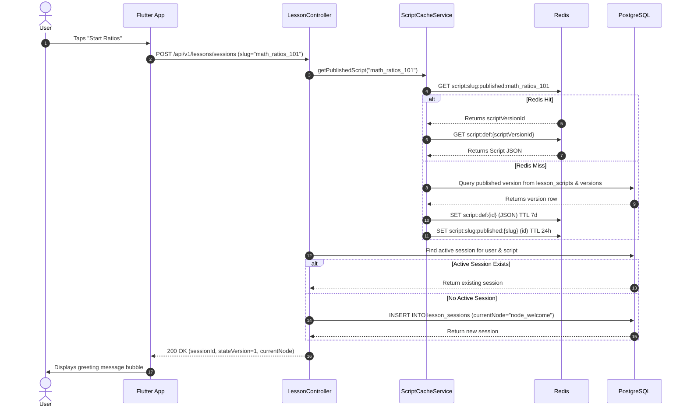
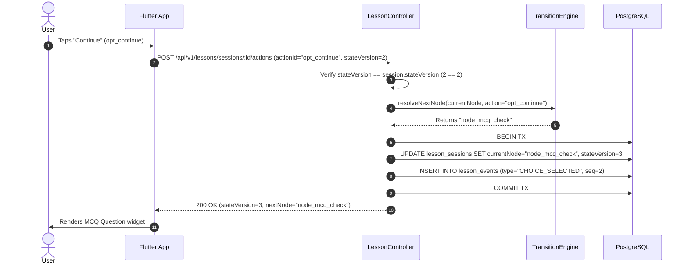
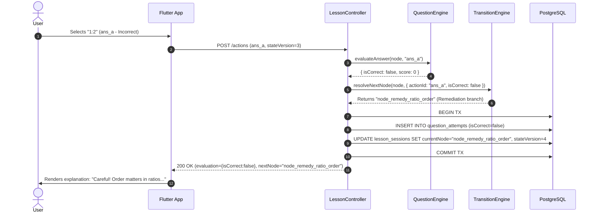
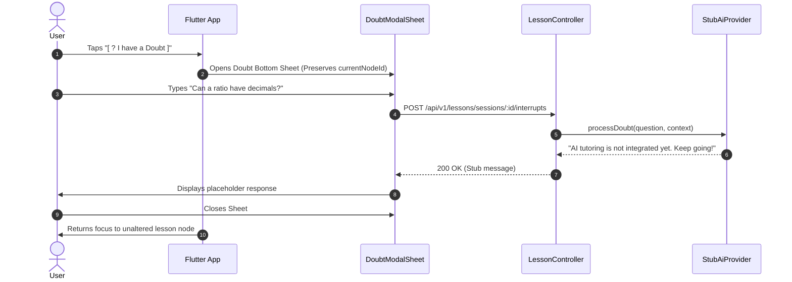
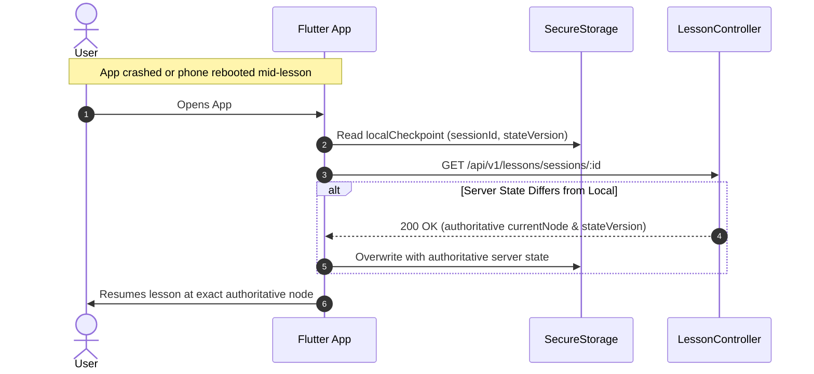
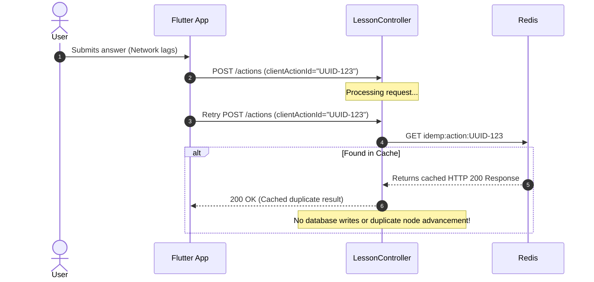

# APTIQU AI TUTOR: TECHNICAL ARCHITECTURE & IMPLEMENTATION PLAN

---

## 1. Executive Summary

Aptiqu AI Tutor is an interactive, conversational learning platform built with Flutter and Node.js/PostgreSQL. While learners perceive the experience as an adaptive 1-on-1 dialogue with an intelligent tutor, **over 90% of the conversational flow is deterministic and script-driven**.

By modeling lessons as versioned Directed Acyclic Graphs (DAGs) and state machines rather than unconstrained Large Language Model (LLM) agent loops:
1. **Operating costs are slashed by 90–98%**, avoiding continuous generative AI token expenditures for greetings, didactic content delivery, multiple-choice questions (MCQs), and standard remediation.
2. **Pedagogical reliability and safety are guaranteed**, preventing hallucinations in mathematical and foundational curriculum concepts.
3. **Sub-second latency (P95 < 80ms)** is achieved through deterministic state transitions and distributed Redis caching.
4. **AI is preserved as a precision intervention**: invoked as an out-of-band "Interrupt" only when learners explicitly trigger doubts or submit open-ended conceptual explanations.

---

## 2. Product Behavior & User Experience

The application presents a conversational feed rather than standard static slides or web forms.

```
┌────────────────────────────────────────────────────────┐
│ [←] Ratios & Proportions - Lesson 1           (Progress: 35%) │
├────────────────────────────────────────────────────────┤
│                                                        │
│  [Avatar] Tutor                                        │
│  "Hey! Are you ready to master Ratios today?"          │
│                                                        │
│                                    [ Yes, let's go! ]  │
│                                                        │
│  [Avatar] Tutor                                        │
│  "A ratio compares two quantities by division.         │
│   For instance, if a recipe has 2 cups of flour and    │
│   1 cup of sugar, the ratio of flour to sugar is 2:1." │
│                                                        │
│  [Avatar] Tutor                                        │
│  "Quick check: What is the ratio of 10 pens to         │
│   5 notebooks?"                                        │
│                                                        │
│  ┌──────────────────────────────────────────────────┐  │
│  │  [A] 1:2       │  [B] 2:1 (Correct)              │  │
│  ├────────────────┼─────────────────────────────────┤  │
│  │  [C] 10:5      │  [D] 5:10                       │  │
│  └──────────────────────────────────────────────────┘  │
│                                                        │
├────────────────────────────────────────────────────────┤
│ [ 🎙️ Mic ] [ 📷 Scan ]      [ ? I have a Doubt ]       │
└────────────────────────────────────────────────────────┘
```

### Conversational Mechanics
- **Feed Progression**: Bubbles animate chronologically into the view. When the user responds, their answer is appended as a user message bubble.
- **Micro-Branches**: Incorrect MCQ answers do not fail the lesson; they trigger targeted remediation nodes before reconnecting to the primary sequence.
- **Interruption Model (Doubt / Help)**: Triggering a doubt pauses the linear lesson flow, opens a contextual doubt sheet/overlay, and preserves the user’s exact lesson node (`currentNodeId`). Upon dismissal, the user resumes immediately where they left off.

---

## 3. Core Architectural Principles

```
      SCRIPT (Immutable Curriculum Definition)
         │
         ▼
     SESSION (Mutable User Execution State in Postgres + Redis)
         │
         ▼
     EVENTS  (Append-Only Log of Every Interaction)
         │
         ▼
    MASTERY  (Cumulative Bayesian/Aggregate Knowledge Profile)
         │
         ▼
       AI    (Ephemeral, Read-Only Contextual Interrupt Layer)
```

1. **Scripts are Immutable, Shared Content Assets**: A single script definition (e.g., *Ratios v8*) is stored once in PostgreSQL and cached in Redis. 100,000 active students reference the exact same memory cache.
2. **Sessions are Per-User State Pointers**: A session contains only `currentNodeId`, `stateVersion`, session variables, and a checkpoint timestamp.
3. **Backend is the Sole Authority**: Flutter is a stateless renderer of the current node. The client **never** decides `nextNodeId`, evaluates correctness, calculates mastery, or marks completion.
4. **Multi-Tenant Schema Isolation**: Leveraging existing PostgreSQL schema partitioning (`auth`, `users`, `gamification`, and introducing `learning`).
5. **Idempotency & Concurrency Safety**: All user mutations require a `clientActionId` (UUID) and an optimistic concurrency `stateVersion`. Network retries or multi-tap events cannot duplicate attempts or corrupt states.

---

## 4. High-Level Design (HLD)

### 4.1 System Topology

```
┌──────────────────────────────────────────────────────────────────────────────┐
│                              FLUTTER CLIENT                                  │
│  ┌─────────────────────────┐  ┌───────────────────┐  ┌────────────────────┐  │
│  │ LessonFeedScreen (GetX) │  │ GenericNodeFactory│  │ LocalCheckpointMgr │  │
│  └────────────┬────────────┘  └─────────▲─────────┘  └────────────────────┘  │
│               │                         │                                    │
└───────────────┼─────────────────────────┼────────────────────────────────────┘
                │ HTTPS / REST            │ Node Payload (JSON)
                ▼                         │
┌─────────────────────────────────────────┴────────────────────────────────────┐
│                    NODE.JS / EXPRESS MODULAR MONOLITH                        │
│                                                                              │
│  ┌────────────────────────────────────────────────────────────────────────┐  │
│  │ Routing & Auth Middleware (JWT / User Verification / Rate Limiting)    │  │
│  └───────────────────────────────────┬────────────────────────────────────┘  │
│                                      ▼                                       │
│  ┌────────────────────────────────────────────────────────────────────────┐  │
│  │ Lesson Engine Module                                                   │  │
│  │  ┌───────────────────┐  ┌───────────────────┐  ┌────────────────────┐  │  │
│  │  │ LessonSessionSvc  │  │ TransitionEngine  │  │ QuestionEngine     │  │  │
│  │  └─────────┬─────────┘  └─────────┬─────────┘  └──────────┬─────────┘  │  │
│  │            │                      │                       │            │  │
│  │  ┌─────────▼─────────┐  ┌─────────▼─────────┐  ┌──────────▼─────────┐  │  │
│  │  │ ScriptCacheSvc    │  │ MasteryService    │  │ AiGateway (Stub/Pvd│  │  │
│  │  └─────────┬─────────┘  └─────────┬─────────┘  └──────────┬─────────┘  │  │
│  └────────────┼──────────────────────┼───────────────────────┼────────────┘  │
└───────────────┼──────────────────────┼───────────────────────┼───────────────┘
                │                      │                       │
      ┌─────────┴─────────┐            │                       │
      ▼                   ▼            ▼                       ▼
┌──────────────┐   ┌──────────────────────────────┐   ┌────────────────────────┐
│ REDIS CACHE  │   │     POSTGRESQL DATABASE      │   │  EXTERNAL SERVICES     │
│              │   │   (Multi-Schema: learning)   │   │                        │
│ • Scripts    │   │ • lesson_scripts             │   │ • Gemini AI (Stubbed)  │
│ • Sessions   │   │ • lesson_script_versions     │   │ • Cloud Object Store   │
│ • Locks      │   │ • lesson_sessions            │   │   (Deferred)           │
│ • Idempotency│   │ • lesson_events              │   │ • Speech-to-Text       │
│              │   │ • questions & attempts       │   │   (Deferred)           │
│              │   │ • student_concept_mastery    │   │                        │
└──────────────┘   └──────────────────────────────┘   └────────────────────────┘
```

### 4.2 Component Responsibilities

| Component | Layer | Primary Responsibility |
| :--- | :--- | :--- |
| **LessonFeedScreen** | Flutter | Renders linear chat stream, collects taps/text, emits user actions. |
| **GenericNodeRenderer** | Flutter | Factory converting declarative node JSON (`CONTENT`, `CHOICE`, `QUESTION`, `TEXT_INPUT`, `COMPLETION`) into UI widgets. |
| **LessonSessionService**| Backend | Orchestrates session creation, resumption, action validation, and persistence. |
| **TransitionEngine** | Backend | Pure state-machine logic. Computes `nextNodeId` by evaluating edge conditions against user input. |
| **QuestionEngine** | Backend | Validates question answers, checks correctness, pulls dynamic items if configured. |
| **MasteryService** | Backend | Calculates rolling mastery increments on verified learning concepts. |
| **ScriptCacheService** | Backend | Multi-tier script loader (Redis L2 with atomic distributed lock to prevent cache stampedes; PostgreSQL L3 fallback). |
| **AiGateway** | Backend | Decoupled abstraction for tutoring interrupts, LLM remediation, and speech processing. |

---

## 5. Low-Level Design (LLD)

### 5.1 Backend Architecture (Node.js + TypeScript + Prisma)

Aligned with existing repository layout (`backend/src/modules/`):

```
backend/src/modules/lesson/
├── dtos/
│   ├── lesson-action.dto.ts
│   ├── lesson-session.dto.ts
│   └── script-validation.dto.ts
├── engines/
│   ├── script-validator.ts
│   └── transition-engine.ts
├── interfaces/
│   ├── ai-gateway.interface.ts
│   ├── script-dsl.interface.ts
│   └── session-state.interface.ts
├── providers/
│   └── stub-ai.provider.ts
├── repositories/
│   ├── lesson-event.repository.ts
│   ├── lesson-script.repository.ts
│   ├── lesson-session.repository.ts
│   ├── mastery.repository.ts
│   └── question.repository.ts
├── services/
│   ├── ai-gateway.service.ts
│   ├── lesson-session.service.ts
│   ├── mastery.service.ts
│   ├── question.service.ts
│   └── script-cache.service.ts
├── lesson.controller.ts
└── lesson.routes.ts
```

#### TypeScript Types & Core Interfaces

```typescript
// backend/src/modules/lesson/interfaces/script-dsl.interface.ts

export type NodeType = 'CONTENT' | 'CHOICE' | 'QUESTION' | 'TEXT_INPUT' | 'COMPLETION';
export type InputType = 'NONE' | 'CHOICE' | 'TEXT' | 'VOICE' | 'IMAGE';

export interface ScriptDefinition {
  schemaVersion: number;
  scriptId: string;
  version: number;
  entryNodeId: string;
  metadata: {
    title: string;
    subjectId: string;
    topicId: string;
    targetDurationMinutes: number;
  };
  nodes: Record<string, LessonNode>;
}

export interface LessonNode {
  id: string;
  type: NodeType;
  content: {
    text: string;
    mediaUrl?: string;
    avatarPersona?: 'TUTOR' | 'SYSTEM' | 'PEER';
  };
  input?: {
    type: InputType;
    options?: Array<{ id: string; label: string; payload?: Record<string, unknown> }>;
    placeholder?: string;
  };
  questionReference?: {
    mode: 'INLINE' | 'REPOSITORY';
    questionId?: string; // UUID in questions table
    inlineData?: {
      prompt: string;
      options: Array<{ id: string; label: string }>;
      correctOptionId: string;
      explanation: string;
    };
  };
  transitions: Array<{
    targetNodeId: string;
    condition?: {
      field: 'actionId' | 'isCorrect' | 'conceptScore';
      operator: 'EQUALS' | 'NOT_EQUALS' | 'GREATER_THAN' | 'LESS_THAN';
      value: string | number | boolean;
    };
  }>;
  interruptible?: boolean;
}
```

```typescript
// backend/src/modules/lesson/engines/transition-engine.ts

export class TransitionEngine {
  public static resolveNextNode(
    currentNode: LessonNode,
    actionPayload: { actionId?: string; answer?: string; isCorrect?: boolean },
    allNodes: Record<string, LessonNode>,
    stateData: { variables: Record<string, unknown> }
  ): string {
    if (currentNode.type === 'COMPLETION') {
      return currentNode.id;
    }

    for (const edge of currentNode.transitions) {
      if (!edge.condition) {
        return edge.targetNodeId; // Default fallback transition
      }

      const { field, operator, value } = edge.condition;
      let actualValue: unknown;

      if (field === 'actionId') actualValue = actionPayload.actionId;
      if (field === 'isCorrect') actualValue = actionPayload.isCorrect;

      if (this.evaluateCondition(actualValue, operator, value)) {
        if (!allNodes[edge.targetNodeId]) {
          throw new Error(`Orphaned target node reference: ${edge.targetNodeId}`);
        }
        return edge.targetNodeId;
      }
    }

    throw new Error(`No valid transition edge resolved from node: ${currentNode.id}`);
  }

  private static evaluateCondition(
    actual: unknown,
    operator: string,
    expected: unknown
  ): boolean {
    switch (operator) {
      case 'EQUALS': return actual === expected;
      case 'NOT_EQUALS': return actual !== expected;
      case 'GREATER_THAN': return Number(actual) > Number(expected);
      case 'LESS_THAN': return Number(actual) < Number(expected);
      default: return false;
    }
  }
}
```

---

## 6. Script DSL Specification

Lessons are written in an unambiguous, JSON-schema-compliant DSL. **No executable JavaScript or dynamic code strings are permitted**.

### 6.1 Complete Concrete Script Example: `ratios-intro.v1.json`

```json
{
  "schemaVersion": 1,
  "scriptId": "math_ratios_101",
  "version": 1,
  "entryNodeId": "node_welcome",
  "metadata": {
    "title": "Introduction to Ratios",
    "subjectId": "math",
    "topicId": "arithmetic",
    "targetDurationMinutes": 8
  },
  "nodes": {
    "node_welcome": {
      "id": "node_welcome",
      "type": "CHOICE",
      "content": {
        "text": "Hey there! Ready to discover how we use Ratios in everyday life?",
        "avatarPersona": "TUTOR"
      },
      "input": {
        "type": "CHOICE",
        "options": [
          { "id": "opt_start", "label": "Yes, let's begin!" },
          { "id": "opt_later", "label": "Pick another topic" }
        ]
      },
      "transitions": [
        {
          "targetNodeId": "node_explain_core",
          "condition": { "field": "actionId", "operator": "EQUALS", "value": "opt_start" }
        },
        {
          "targetNodeId": "node_exit_topic",
          "condition": { "field": "actionId", "operator": "EQUALS", "value": "opt_later" }
        }
      ],
      "interruptible": false
    },
    "node_explain_core": {
      "id": "node_explain_core",
      "type": "CONTENT",
      "content": {
        "text": "A ratio simply compares two quantities. For example, if a punch recipe calls for 3 cups of orange juice and 1 cup of soda, the ratio of juice to soda is 3 to 1 (written as 3:1).",
        "avatarPersona": "TUTOR"
      },
      "input": {
        "type": "CHOICE",
        "options": [
          { "id": "opt_continue", "label": "Got it, continue" },
          { "id": "opt_doubt", "label": "I have a doubt" }
        ]
      },
      "transitions": [
        {
          "targetNodeId": "node_mcq_check",
          "condition": { "field": "actionId", "operator": "EQUALS", "value": "opt_continue" }
        }
      ],
      "interruptible": true
    },
    "node_mcq_check": {
      "id": "node_mcq_check",
      "type": "QUESTION",
      "content": {
        "text": "Let's test this: If you have 10 red pens and 5 blue pens in your bag, what is the ratio of red pens to blue pens in simplest form?",
        "avatarPersona": "TUTOR"
      },
      "questionReference": {
        "mode": "INLINE",
        "inlineData": {
          "prompt": "Ratio of 10 red pens to 5 blue pens in simplest form:",
          "options": [
            { "id": "ans_a", "label": "1 : 2" },
            { "id": "ans_b", "label": "2 : 1" },
            { "id": "ans_c", "label": "10 : 5" },
            { "id": "ans_d", "label": "5 : 10" }
          ],
          "correctOptionId": "ans_b",
          "explanation": "10 divided by 5 is 2, and 5 divided by 5 is 1. The simplified ratio is 2:1."
        }
      },
      "input": {
        "type": "CHOICE"
      },
      "transitions": [
        {
          "targetNodeId": "node_remedy_ratio_order",
          "condition": { "field": "actionId", "operator": "EQUALS", "value": "ans_a" }
        },
        {
          "targetNodeId": "node_remedy_unsimplified",
          "condition": { "field": "actionId", "operator": "EQUALS", "value": "ans_c" }
        },
        {
          "targetNodeId": "node_correct_affirmation",
          "condition": { "field": "isCorrect", "operator": "EQUALS", "value": true }
        },
        {
          "targetNodeId": "node_remedy_general",
          "condition": { "field": "isCorrect", "operator": "EQUALS", "value": false }
        }
      ],
      "interruptible": true
    },
    "node_remedy_ratio_order": {
      "id": "node_remedy_ratio_order",
      "type": "CONTENT",
      "content": {
        "text": "Careful! Order matters in ratios. Since we asked for 'red to blue', the red count (10) comes first, and blue (5) second: 10:5 simplifies to 2:1, not 1:2.",
        "avatarPersona": "TUTOR"
      },
      "input": {
        "type": "CHOICE",
        "options": [{ "id": "opt_retry", "label": "Understood, let's keep going" }]
      },
      "transitions": [
        { "targetNodeId": "node_open_text_prompt" }
      ],
      "interruptible": true
    },
    "node_remedy_unsimplified": {
      "id": "node_remedy_unsimplified",
      "type": "CONTENT",
      "content": {
        "text": "10:5 is the unsimplified ratio! Always divide both sides by the greatest common divisor (5) to get 2:1.",
        "avatarPersona": "TUTOR"
      },
      "input": {
        "type": "CHOICE",
        "options": [{ "id": "opt_retry", "label": "Got it, simplify always" }]
      },
      "transitions": [
        { "targetNodeId": "node_open_text_prompt" }
      ],
      "interruptible": true
    },
    "node_remedy_general": {
      "id": "node_remedy_general",
      "type": "CONTENT",
      "content": {
        "text": "Not quite. Remember: divide both numbers by their highest common factor. 10 / 5 = 2, and 5 / 5 = 1, giving 2:1.",
        "avatarPersona": "TUTOR"
      },
      "input": {
        "type": "CHOICE",
        "options": [{ "id": "opt_retry", "label": "Let's proceed" }]
      },
      "transitions": [
        { "targetNodeId": "node_open_text_prompt" }
      ],
      "interruptible": true
    },
    "node_correct_affirmation": {
      "id": "node_correct_affirmation",
      "type": "CONTENT",
      "content": {
        "text": "Spot on! 10 red to 5 blue simplifies cleanly to 2:1. You nailed the simplification.",
        "avatarPersona": "TUTOR"
      },
      "input": {
        "type": "CHOICE",
        "options": [{ "id": "opt_next", "label": "Next challenge" }]
      },
      "transitions": [
        { "targetNodeId": "node_open_text_prompt" }
      ],
      "interruptible": false
    },
    "node_open_text_prompt": {
      "id": "node_open_text_prompt",
      "type": "TEXT_INPUT",
      "content": {
        "text": "In your own words, explain why a ratio of 4:8 is exactly identical in value to 1:2.",
        "avatarPersona": "TUTOR"
      },
      "input": {
        "type": "TEXT",
        "placeholder": "Type your reasoning here..."
      },
      "transitions": [
        { "targetNodeId": "node_lesson_finish" }
      ],
      "interruptible": true
    },
    "node_exit_topic": {
      "id": "node_exit_topic",
      "type": "COMPLETION",
      "content": {
        "text": "No problem! You can pick another topic from your home screen.",
        "avatarPersona": "SYSTEM"
      },
      "transitions": []
    },
    "node_lesson_finish": {
      "id": "node_lesson_finish",
      "type": "COMPLETION",
      "content": {
        "text": "Awesome job! You've successfully completed the introduction to Ratios.",
        "avatarPersona": "TUTOR"
      },
      "transitions": []
    }
  }
}
```

---

## 7. PostgreSQL Database Design

The project uses Prisma with PostgreSQL and `multiSchema` preview feature (currently configured with `schemas = ["auth", "users", "gamification"]`). We introduce the dedicated **`learning`** schema.

```prisma
// backend/prisma/schema.prisma additions

datasource db {
  provider = "postgresql"
  url      = env("DATABASE_URL")
  schemas  = ["auth", "users", "gamification", "learning"]
}

// -----------------------------------------------------------------------------
// CORE SCRIPT & CURRICULUM TABLES [MVP - IMPLEMENT NOW]
// -----------------------------------------------------------------------------

enum ScriptStatus {
  DRAFT
  REVIEW
  PUBLISHED
  ARCHIVED
  @@schema("learning")
}

model LessonScript {
  id                 String                @id @default(uuid()) @db.Uuid
  slug               String                @unique
  title              String
  subjectId          String                @map("subject_id")
  topicId            String                @map("topic_id")
  subtopicId         String?               @map("subtopic_id")
  status             ScriptStatus          @default(DRAFT)
  publishedVersionId String?               @unique @map("published_version_id") @db.Uuid
  createdAt          DateTime              @default(now()) @map("created_at")
  updatedAt          DateTime              @updatedAt @map("updated_at")

  versions           LessonScriptVersion[]
  sessions           LessonSession[]

  @@index([subjectId, topicId])
  @@map("lesson_scripts")
  @@schema("learning")
}

model LessonScriptVersion {
  id            String       @id @default(uuid()) @db.Uuid
  scriptId      String       @map("script_id") @db.Uuid
  versionNumber Int          @map("version_number")
  schemaVersion Int          @default(1) @map("schema_version")
  definition    Json         @db.JsonB
  checksum      String
  status        ScriptStatus @default(DRAFT)
  createdBy     String?      @map("created_by") @db.Uuid
  createdAt     DateTime     @default(now()) @map("created_at")
  publishedAt   DateTime?    @map("published_at")

  script        LessonScript @relation(fields: [scriptId], references: [id], onDelete: Cascade)
  sessions      LessonSession[]

  @@unique([scriptId, versionNumber])
  @@index([scriptId, status])
  @@map("lesson_script_versions")
  @@schema("learning")
}

// -----------------------------------------------------------------------------
// SESSION & EXECUTION STATE [MVP - IMPLEMENT NOW]
// -----------------------------------------------------------------------------

enum SessionStatus {
  ACTIVE
  PAUSED
  COMPLETED
  ABANDONED
  @@schema("learning")
}

model LessonSession {
  id              String              @id @default(uuid()) @db.Uuid
  userId          String              @map("user_id") @db.Uuid
  scriptId        String              @map("script_id") @db.Uuid
  scriptVersionId String              @map("script_version_id") @db.Uuid
  status          SessionStatus       @default(ACTIVE)
  currentNodeId   String              @map("current_node_id")
  stateData       Json                @default("{}") @map("state_data") @db.JsonB
  stateVersion    Int                 @default(1) @map("state_version")
  startedAt       DateTime            @default(now()) @map("started_at")
  lastActivityAt  DateTime            @default(now()) @map("last_activity_at")
  completedAt     DateTime?           @map("completed_at")

  user            User                @relation(fields: [userId], references: [id], onDelete: Cascade)
  script          LessonScript        @relation(fields: [scriptId], references: [id], onDelete: Restrict)
  scriptVersion   LessonScriptVersion @relation(fields: [scriptVersionId], references: [id], onDelete: Restrict)
  events          LessonEvent[]
  questionAttempts QuestionAttempt[]

  @@index([userId, status])
  @@index([scriptId, userId])
  @@map("lesson_sessions")
  @@schema("learning")
}

// -----------------------------------------------------------------------------
// LEARNING EVENTS (AUDIT & ANALYTICS) [MVP - IMPLEMENT NOW]
// -----------------------------------------------------------------------------

model LessonEvent {
  id              String        @id @default(uuid()) @db.Uuid
  sessionId       String        @map("session_id") @db.Uuid
  userId          String        @map("user_id") @db.Uuid
  sequenceNumber  Int           @map("sequence_number")
  nodeId          String        @map("node_id")
  eventType       String        @map("event_type")
  clientActionId  String        @unique @map("client_action_id")
  payload         Json          @default("{}") @db.JsonB
  createdAt       DateTime      @default(now()) @map("created_at")

  session         LessonSession @relation(fields: [sessionId], references: [id], onDelete: Cascade)

  @@index([sessionId, sequenceNumber])
  @@map("lesson_events")
  @@schema("learning")
}

// -----------------------------------------------------------------------------
// QUESTIONS & ATTEMPTS [MVP - IMPLEMENT NOW]
// -----------------------------------------------------------------------------

model Question {
  id             String            @id @default(uuid()) @db.Uuid
  conceptId      String?           @map("concept_id") @db.Uuid
  prompt         String
  questionType   String            @default("MCQ") @map("question_type")
  options        Json              @db.JsonB
  correctAnswer  String            @map("correct_answer")
  explanation    String?
  difficulty     Int               @default(1) // 1-5
  createdAt      DateTime          @default(now()) @map("created_at")

  concept        Concept?          @relation(fields: [conceptId], references: [id], onDelete: SetNull)
  attempts       QuestionAttempt[]

  @@map("questions")
  @@schema("learning")
}

model QuestionAttempt {
  id             String        @id @default(uuid()) @db.Uuid
  userId         String        @map("user_id") @db.Uuid
  sessionId      String        @map("session_id") @db.Uuid
  questionId     String?       @map("question_id") @db.Uuid
  nodeId         String        @map("node_id")
  clientActionId String        @unique @map("client_action_id")
  rawAnswer      String        @map("raw_answer")
  isCorrect      Boolean       @map("is_correct")
  score          Float         @default(0.0)
  responseTimeMs Int?          @map("response_time_ms")
  createdAt      DateTime      @default(now()) @map("created_at")

  session        LessonSession @relation(fields: [sessionId], references: [id], onDelete: Cascade)
  question       Question?     @relation(fields: [questionId], references: [id], onDelete: SetNull)

  @@index([userId, questionId])
  @@index([sessionId, nodeId])
  @@map("question_attempts")
  @@schema("learning")
}

// -----------------------------------------------------------------------------
// CONCEPTS & MASTERY [MVP - IMPLEMENT NOW FOUNDATION]
// -----------------------------------------------------------------------------

model Concept {
  id          String                 @id @default(uuid()) @db.Uuid
  code        String                 @unique // e.g., "MATH_RATIO_SIMPLIFY"
  title       String
  subjectId   String                 @map("subject_id")
  topicId     String                 @map("topic_id")
  createdAt   DateTime               @default(now()) @map("created_at")

  questions   Question[]
  masteries   StudentConceptMastery[]

  @@map("concepts")
  @@schema("learning")
}

model StudentConceptMastery {
  id             String    @id @default(uuid()) @db.Uuid
  userId         String    @map("user_id") @db.Uuid
  conceptId      String    @map("concept_id") @db.Uuid
  masteryScore   Float     @default(0.0) @map("mastery_score") // 0.0 - 1.0
  totalAttempts  Int       @default(0) @map("total_attempts")
  correctAttempts Int      @default(0) @map("correct_attempts")
  lastAttemptAt  DateTime  @default(now()) @map("last_attempt_at")
  lastCorrectAt  DateTime? @map("last_correct_at")
  updatedAt      DateTime  @updatedAt @map("updated_at")

  concept        Concept   @relation(fields: [conceptId], references: [id], onDelete: Cascade)

  @@unique([userId, conceptId])
  @@map("student_concept_mastery")
  @@schema("learning")
}

// -----------------------------------------------------------------------------
// AI DOUBT & INTERRUPT CONVERSATIONS [STUB / SCAFFOLD NOW]
// -----------------------------------------------------------------------------

model AiConversation {
  id              String        @id @default(uuid()) @db.Uuid
  userId          String        @map("user_id") @db.Uuid
  sessionId       String        @map("session_id") @db.Uuid
  scriptVersionId String        @map("script_version_id") @db.Uuid
  nodeId          String        @map("node_id")
  status          String        @default("OPEN")
  createdAt       DateTime      @default(now()) @map("created_at")
  closedAt        DateTime?     @map("closed_at")

  messages        AiMessage[]

  @@index([sessionId, nodeId])
  @@map("ai_conversations")
  @@schema("learning")
}

model AiMessage {
  id               String         @id @default(uuid()) @db.Uuid
  conversationId   String         @map("conversation_id") @db.Uuid
  sender           String         // "USER" | "AI_TUTOR"
  content          String
  tokensUsed       Int?           @map("tokens_used")
  modelId          String?        @map("model_id")
  createdAt        DateTime       @default(now()) @map("created_at")

  conversation     AiConversation @relation(fields: [conversationId], references: [id], onDelete: Cascade)

  @@map("ai_messages")
  @@schema("learning")
}
```

---

## 8. Redis Caching & Distributed Locking Architecture

Redis acts strictly as an acceleration and coordination layer (`ioredis`). PostgreSQL is always the durable source of truth.

### Key Hierarchy, Values & TTLs

| Key Pattern | Purpose | Data Type | TTL | Eviction Policy |
| :--- | :--- | :--- | :--- | :--- |
| `script:def:{scriptVersionId}` | Cached JSON definition of a published script. | String (JSON) | 7 days | **Immutable**. Distinct version IDs. |
| `script:slug:published:{slug}` | Pointer resolving script slug to published `scriptVersionId`. | String (UUID) | 24 hours | Invalidated via `DEL` on publish. |
| `session:active:{sessionId}` | Ephemeral snapshot of current node and variables. | Hash / String (JSON) | 2 hours (sliding) | Written on every user action. |
| `lock:session:{sessionId}` | Distributed mutex preventing parallel mutations. | Redlock / SET NX PX | 3000 ms | Auto-released after transaction. |
| `idemp:action:{clientActionId}` | Idempotency lock & result cache for retry suppression. | String (JSON) | 24 hours | Cached HTTP response returned directly. |

---

## 9. REST API Specification

### Endpoints Summary

| Method | Endpoint | Description | Idempotent |
| :--- | :--- | :--- | :--- |
| `POST` | `/api/v1/lessons/sessions` | Start a new session or return active resumable session for a script. | Yes (via `clientActionId`) |
| `GET` | `/api/v1/lessons/sessions/:id` | Fetch full authoritative state and current node details. | Yes |
| `POST` | `/api/v1/lessons/sessions/:id/actions`| Submit choice/text/answer to transition the state machine. | Yes (via `clientActionId`) |
| `POST` | `/api/v1/lessons/sessions/:id/pause` | Manually pause active session. | Yes |
| `POST` | `/api/v1/lessons/sessions/:id/resume`| Re-activate a paused session. | Yes |
| `POST` | `/api/v1/lessons/sessions/:id/interrupts` | [STUB] Trigger an AI doubt interruption. | Yes |

---

## 10. Frontend Architecture (Flutter / Dart)

Matches existing codebase conventions: `get: ^4.7.3`, `go_router: ^17.2.3`, `dio: ^5.11.1`.

```dart
// lib/features/lesson/views/widgets/node_renderer_factory.dart

import 'package:flutter/material.dart';
import '../../models/lesson_node_model.dart';
import 'content_node_widget.dart';
import 'choice_input_widget.dart';
import 'question_node_widget.dart';
import 'text_input_widget.dart';
import 'completion_node_widget.dart';

class NodeRendererFactory {
  static Widget buildNodeWidget({
    required LessonNodeModel node,
    required Function(String actionId, dynamic payload) onActionSubmitted,
    required VoidCallback onDoubtRequested,
  }) {
    switch (node.type) {
      case 'CONTENT':
        return ContentNodeWidget(
          node: node,
          onAction: (optId) => onActionSubmitted(optId, null),
          onDoubt: onDoubtRequested,
        );
      case 'CHOICE':
        return ChoiceInputWidget(
          node: node,
          onSelect: (optId) => onActionSubmitted(optId, null),
        );
      case 'QUESTION':
        return QuestionNodeWidget(
          node: node,
          onAnswerSubmitted: (ansId) => onActionSubmitted('SUBMIT_ANSWER', ansId),
          onDoubt: onDoubtRequested,
        );
      case 'TEXT_INPUT':
        return TextInputWidget(
          node: node,
          onSubmit: (text) => onActionSubmitted('SUBMIT_TEXT', text),
          onDoubt: onDoubtRequested,
        );
      case 'COMPLETION':
        return CompletionNodeWidget(node: node);
      default:
        return Center(
          child: Text('Unsupported node format: ${node.type}'),
        );
    }
  }
}
```

---

## 11. Backend Execution Flow & Atomic Steps

1. **Redlock Acquisition**: Acquire lock `lock:session:{sessionId}` with a 3,000ms TTL.
2. **Idempotency Guard**: Check `idemp:action:{clientActionId}`. If cached, release lock and return previous response directly.
3. **Optimistic Concurrency Check**: Verify incoming `stateVersion == session.stateVersion`. If unequal, reject with `409 Conflict`.
4. **Action & Node Validation**: Ensure `currentNodeId == session.currentNodeId` and action exists in allowed node actions.
5. **Question Evaluation** (if node type is `QUESTION`): Compare user response to stored answer key. Calculate correctness and score.
6. **Transition Evaluation**: Feed action into `TransitionEngine.resolveNextNode()`.
7. **Database Transaction**:
   - `UPDATE lesson_sessions` (`currentNodeId = nextNodeId`, `stateVersion = stateVersion + 1`, `lastActivityAt = NOW()`).
   - `INSERT INTO lesson_events` (`sequenceNumber = stateVersion`, `clientActionId`, `payload`).
   - If question: `INSERT INTO question_attempts`.
   - If question & correct: update `student_concept_mastery`.
8. **Redis Updates**:
   - Update `session:active:{sessionId}`.
   - Set `idemp:action:{clientActionId}` with 24h TTL.
9. **Release Redlock** and respond with `HTTP 200`.

---

## 12. Sequence Diagrams

### 12.1 Lesson Start Sequence


### 12.2 Normal Node Progression


### 12.3 Question Answer & Remediation Branch


### 12.4 AI Doubt Interruption Flow


### 12.5 App Restart & State Reconciliation


### 12.6 Duplicate Request / Network Retry (Idempotency)


---

## 13. Concurrency, Locking & Consistency

1. **Double Tap Race Condition**: Client disables buttons upon submission (`FeedStatus.submitting`). Redis distributed lock (`SET lock:session:{id} NX PX 3000`) serializes server intake. Subsequent duplicate requests match `clientActionId` in Redis and immediately return the cached result.
2. **Multi-Device Sync**: Optimistic locking via `stateVersion`. The device with the stale version receives `HTTP 409 Conflict` containing the updated server state, triggering a clean state reload.

---

## 14. Error Handling Strategy

### HTTP Error Mapping

| HTTP Code | Error Code | Triggering Condition | Client Recovery Action |
| :--- | :--- | :--- | :--- |
| `400 Bad Request` | `INVALID_ACTION` | Option submitted does not exist in node options. | Display local alert; re-render current node. |
| `401 Unauthorized`| `UNAUTHORIZED` | Expired or missing Bearer JWT token. | Redirect user to login screen via GoRouter. |
| `404 Not Found` | `SESSION_NOT_FOUND`| Session ID does not exist in database. | Clear local checkpoint and return to home feed. |
| `409 Conflict` | `STALE_STATE_VERSION`| Client `stateVersion` is behind server state. | Overwrite local state with payload's `authoritativeNodeId`. |
| `429 Too Many Req`| `RATE_LIMITED` | Exceeded 30 action submissions per minute. | Toast message: "Slow down! Reading is learning." |
| `500 Server Error`| `INTERNAL_ERROR` | Unhandled backend exception. | Retry button with exponential backoff. |

---

## 15. Security Architecture

1. **Zero Client Trust**: Node IDs and transitions provided in API requests are strictly treated as advisory assertions. The backend evaluates transitions using the authoritative stored script definition.
2. **Answer Masking**: The client **never receives the answer key**. For `QUESTION` nodes, the backend strips `correctOptionId` and `explanation` from the payload sent to Flutter. Explanation is only revealed *after* an answer attempt is submitted.
3. **Session Ownership Enforcement**: Middleware verifies `session.userId == req.user.id`. Cross-user inspection attempts return `404 Not Found`.
4. **Input Sanitization**: Text input strings are stripped of HTML/script injection tags and capped at 500 characters.

---

## 16. Observability & Telemetry

### Structured Logging (JSON via Winston)
```json
{
  "timestamp": "2026-09-25T10:45:00.120Z",
  "level": "info",
  "service": "lesson-engine",
  "sessionId": "a4d3f572-1b6c-48be-8f92-5d9c72e12811",
  "userId": "d1c2b3a4-5e6f-7a8b-9c0d-1e2f3a4b5c6d",
  "scriptId": "math_ratios_101",
  "scriptVersion": 1,
  "nodeId": "node_mcq_check",
  "actionType": "QUESTION_ANSWER",
  "isCorrect": true,
  "durationMs": 42
}
```

---

## 17. Testing Strategy

1. **Script Validation Unit Tests**:
   - Verify circular references without termination are rejected.
   - Verify every transition target resolves to an existing node in the same script.
   - Verify every question reference has a valid inline or database question ID.
2. **Transition Engine Unit Tests**:
   - Test equality, inequality, greater-than, and less-than edge conditions.
   - Verify default fallback edge executes when specific condition fails.
3. **Concurrency Integration Tests**:
   - Spawn 10 simultaneous asynchronous HTTP requests with identical `stateVersion` to test atomic locking and version increments.
4. **Flutter Golden & Widget Tests**:
   - Test that `NodeRendererFactory` renders correct input controls for all 5 node types.

---

## 18. Future Extension Path & Deferred Features

### 18.1 AI Tutoring Layer (Gemini 3.1 & 3.5 Flash-Lite) [STUB / SCAFFOLD NOW]

```typescript
// backend/src/modules/lesson/interfaces/ai-gateway.interface.ts

export interface AiDoubtContext {
  topicTitle: string;
  currentNodeContent: string;
  recentAttempts: Array<{ prompt: string; userRawAnswer: string; isCorrect: boolean }>;
  userQuestion: string;
}

export interface IAiGateway {
  answerDoubt(context: AiDoubtContext): Promise<string>;
  evaluateOpenText(prompt: string, answer: string, rubric: string): Promise<{ score: number; feedback: string }>;
}
```

### 18.2 Voice Interaction Integration [STUB / SCAFFOLD NOW]
- **Frontend**: Shows a microphone icon on question and text nodes. Tapping it opens a bottom sheet showing: *"Voice interaction is coming soon to Aptiqu!"*. No audio buffers are recorded or sent.
- **Future Integration Path**: Flutter records 16kHz PCM audio -> uploads to temporary signed S3 URL -> backend invokes Google Cloud Speech-to-Text / Gemini Multimodal -> converts transcript into standard text action -> passes to Lesson Engine.

### 18.3 Image & Homework Scanning [STUB / SCAFFOLD NOW]
- **Frontend**: Shows a camera icon. Tapping it opens an image picker dialog stubbed with: *"Image-based evaluation is coming soon!"*.
- **Future Integration Path**: S3 pre-signed upload URL -> client pushes image -> backend invokes Gemini Flash-Lite Vision with structured JSON output -> parsed mathematical steps mapped to lesson remediation nodes.

---

## 19. Migration Strategy for Existing Aptiqu Codebase

1. **Database Schema**: Add `"learning"` to the `schemas` array in `backend/prisma/schema.prisma`. Execute `npx prisma db push` or `npx prisma migrate dev --name init_learning_schema`. No existing tables in `auth`, `users`, or `gamification` are dropped or modified.
2. **Redis Setup**: Install `ioredis` and `@types/ioredis`. Configure Redis connection URL in `backend/.env` (`REDIS_URL=redis://127.0.0.1:6379`). Provide an in-memory fallback map if Redis is not locally provisioned during development.
3. **Flutter Integration**: Add `lesson` feature directory under `lib/features/lesson/`. Mount lesson routes in `lib/core/routing/app_router.dart` (`/lesson/:slug`).

---

## 20. MVP vs. Future Scope Matrix

| Feature | Scope Status | Notes / Rationale |
| :--- | :--- | :--- |
| **Deterministic Script Engine (DAGs)** | `[MVP - IMPLEMENT NOW]` | Core backbone for all lessons. |
| **Choice & MCQ Nodes** | `[MVP - IMPLEMENT NOW]` | Powers 85%+ of lesson interactions. |
| **Open-Ended Text Input Nodes** | `[MVP - IMPLEMENT NOW]` | Stored in DB; stub evaluation. |
| **Lesson Resumption & State Machine** | `[MVP - IMPLEMENT NOW]` | Allows graceful recovery from drops. |
| **Redis Script & Session Caching** | `[MVP - IMPLEMENT NOW]` | Ensures high concurrency and sub-100ms P95. |
| **Idempotency & Concurrency Locks** | `[MVP - IMPLEMENT NOW]` | Prevents duplicate taps and race conditions. |
| **Basic Concept Mastery Foundation** | `[MVP - IMPLEMENT NOW]` | Records attempts and calculates rolling accuracy. |
| **AI Doubt Gateway Interface** | `[STUB / SCAFFOLD NOW]` | Clean interface with deterministic stub. |
| **AI Doubt UI Overlay** | `[STUB / SCAFFOLD NOW]` | Bottom sheet with placeholder response. |
| **Voice UI Button & Stub Dialog** | `[STUB / SCAFFOLD NOW]` | Shows "Coming soon" modal. No audio SDK. |
| **Image UI Button & Stub Dialog** | `[STUB / SCAFFOLD NOW]` | Shows "Coming soon" modal. No object storage. |
| **Live Gemini API Token Integration**| `[DEFER - DOCUMENT ONLY]` | Deferred to control MVP operating cost. |
| **Speech-to-Text / Audio Uploads** | `[DEFER - DOCUMENT ONLY]` | Requires cloud storage and audio pipeline. |
| **Vision / Image OCR Processing** | `[DEFER - DOCUMENT ONLY]` | Requires S3/GCS bucket and vision API. |
| **Visual Admin Lesson Graph Builder** | `[DEFER - DOCUMENT ONLY]` | JSON files validated via CLI/scripts for MVP. |
| **Bayesian Knowledge Tracing (BKT)** | `[DEFER - DOCUMENT ONLY]` | Complex adaptive learning deferred to Phase 2. |

---

## 21. Detailed Implementation Phases

- **Phase 0**: Codebase Verification & Environment Setup
- **Phase 1**: Database Schema & Script Models
- **Phase 2**: Backend Core Engine & State Machine
- **Phase 3**: REST API Endpoints & Auth Middleware
- **Phase 4**: Flutter Lesson UI & Node Renderers
- **Phase 5**: Concurrency, Idempotency & Resumption Hardening
- **Phase 6**: Stubs & Placeholders (AI Doubt, Voice, Image)
- **Phase 7**: Verification & Polishing

---

## 22. Task-by-Task Developer Checklist

```markdown
### Backend Tasks
- [ ] 1. Update `backend/prisma/schema.prisma` to include schema `learning` and all models.
- [ ] 2. Run `npm run prisma:generate` and apply migration via `npx prisma db push`.
- [ ] 3. Install dependencies: `npm install ioredis uuid` and `npm install --save-dev @types/ioredis @types/uuid`.
- [ ] 4. Create `backend/src/modules/lesson/interfaces/script-dsl.interface.ts`.
- [ ] 5. Implement `backend/src/modules/lesson/engines/script-validator.ts`.
- [ ] 6. Implement `backend/src/modules/lesson/engines/transition-engine.ts`.
- [ ] 7. Implement `backend/src/modules/lesson/services/script-cache.service.ts` with Redis + stampede lock.
- [ ] 8. Implement `backend/src/modules/lesson/services/lesson-session.service.ts`.
- [ ] 9. Implement `backend/src/modules/lesson/providers/stub-ai.provider.ts`.
- [ ] 10. Implement `backend/src/modules/lesson/lesson.controller.ts` and `lesson.routes.ts`.
- [ ] 11. Register `/api/v1/lessons` in `backend/src/app.ts`.
- [ ] 12. Create seed script `backend/prisma/seed-lesson.ts` inserting *Ratios 101* JSON.

### Frontend (Flutter) Tasks
- [ ] 13. Create `lib/features/lesson/models/lesson_node_model.dart` and `lesson_session_model.dart`.
- [ ] 14. Create `lib/features/lesson/repositories/lesson_repository.dart` using existing Dio instance.
- [ ] 15. Create `lib/features/lesson/controllers/lesson_feed_controller.dart`.
- [ ] 16. Build individual node widgets:
      - `content_node_widget.dart`
      - `choice_input_widget.dart`
      - `question_node_widget.dart`
      - `text_input_widget.dart`
      - `completion_node_widget.dart`
- [ ] 17. Build `node_renderer_factory.dart`.
- [ ] 18. Build `doubt_sheet_widget.dart` (AI doubt stub).
- [ ] 19. Build `voice_stub_sheet.dart` and `image_stub_dialog.dart`.
- [ ] 20. Build main `lesson_feed_screen.dart` with animated auto-scroll.
- [ ] 21. Register route `/lesson/:slug` in `lib/core/routing/app_router.dart`.
```

---

## 23. Final Product Decisions

### A. What We Are Actually Building Now (MVP Scope)
1. **Fully Deterministic Script Engine**: Interpreting declarative JSON DAG lessons without AI hallucination.
2. **Five Core Node Types**: `CONTENT`, `CHOICE`, `QUESTION` (MCQ with automated remediation branches), `TEXT_INPUT` (recorded in DB), and `COMPLETION`.
3. **Authoritative Session Management**: Stateful PostgreSQL tracking with sub-second Redis caching and resumption capability.
4. **Clean Flutter Chat Experience**: Dynamic feed rendering nodes based on server state with local retry guards.
5. **Architectural Scaffolding for AI, Voice, and Vision**: Stubbed endpoints and UX placeholders that allow zero-downtime additions later.

### B. What We Are Deliberately NOT Building Yet (With Reasons)
- **Live Gemini LLM Streaming**: Dropped for MVP to maintain zero variable AI cost and predictable lesson flow.
- **Audio Recording & Cloud Speech-to-Text**: Avoids complex binary media pipelines and object storage overhead.
- **Image Scanning & Vision Processing**: Avoids cloud bucket provisioning, signed URL infrastructure, and OCR costs.
- **Visual Web-Based Lesson Graph Builder**: Scripts are written in clean JSON and validated automatically by code.
- **Complex Adaptive Learning Algorithms**: Standard mastery count and rolling accuracy is sufficient for initial traction.

### C. What Future Architecture is Already Prepared For
- **Pluggable AI Provider**: `IAiGateway` is isolated behind `AiGatewayService`. Swapping `StubAiProvider` with `GeminiProvider` requires editing only one file without touching session or transition logic.
- **Cloud Media Ready**: Node DSL supports `mediaUrl` fields, and the input model reserves `VOICE` and `IMAGE` enum slots.
- **Zero-Downtime Curriculum Publishing**: Script version immutability ensures students in progress are never disrupted by new lesson releases.

### D. Recommended Implementation Order
1. **Prisma Schema & Ratios JSON Definition**
2. **Transition Engine & Script Validator**
3. **Redis Script Cache & Session Service**
4. **Backend REST APIs**
5. **Flutter Node Widgets & Feed Controller**
6. **AI Doubt, Voice, and Image UI Placeholders**

### E. Definition of Done (DoD)
- A student can open *Ratios 101* on Flutter, progress through greetings, read didactic content, answer an MCQ, receive targeted remediation on a wrong answer, submit a reflection text, and reach the completion node.
- An app killed mid-lesson restarts and resumes at the exact node where the student stopped.
- P95 backend response time across cached node transitions is strictly under **80ms**.
- 100% of user actions are logged idempotently without state corruption or duplicate records.
